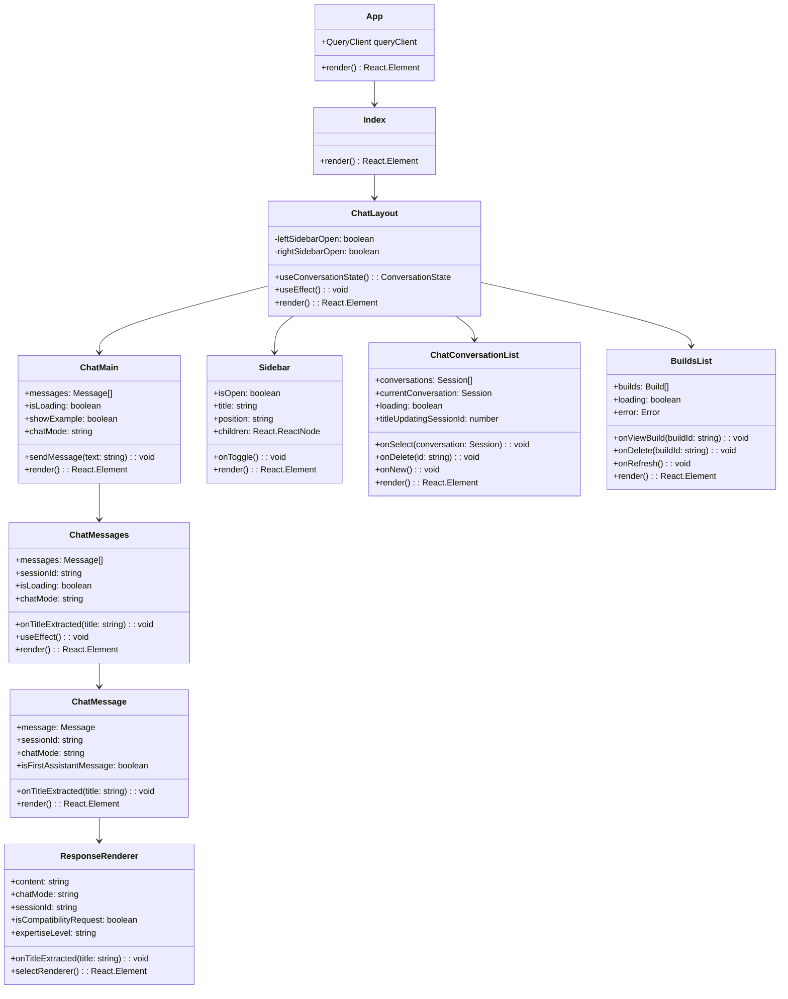
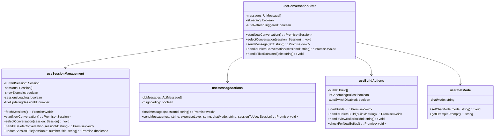
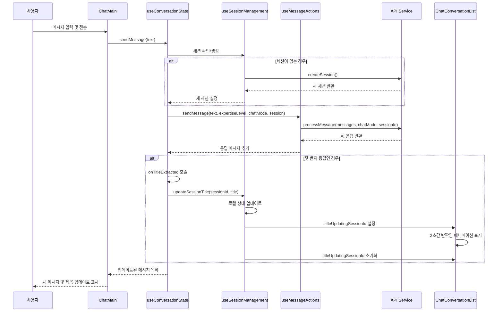
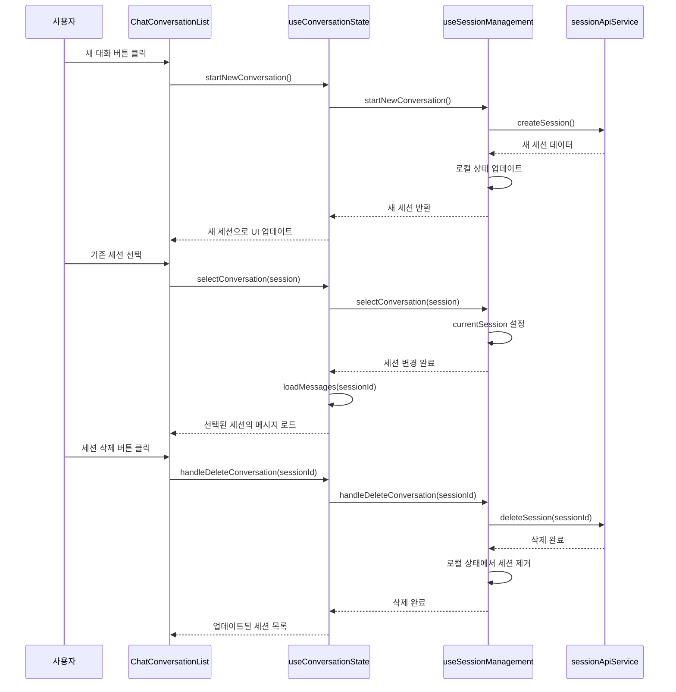

# PC 견적 AI 어시스턴트 Frontend - Design Specification

## 1. 프로젝트 개요 (Project Overview)

### 1.1 목표 (Objectives)
- **주요 목표**: 사용자가 원하는 용도에 맞는 컴퓨터 견적을 AI를 통해 추천받을 수 있는 웹 애플리케이션
- **사용자 경험**: 직관적이고 반응형인 채팅 인터페이스를 통한 견적 상담
- **기능적 목표**:
  - 실시간 채팅 기반 견적 상담
  - 다양한 모드별 전문 상담 (범용 검색, 부품 추천, 호환성 검사, 견적 추천, 스펙 업그레이드, 견적 평가)
  - 세션 기반 대화 관리
  - 생성된 견적 목록 관리

### 1.2 기술 스택 (Technology Stack)
- **Frontend Framework**: React 18 with TypeScript
- **Build Tool**: Vite
- **Styling**: Tailwind CSS + shadcn/ui components
- **State Management**: React Hooks (useState, useEffect, custom hooks)
- **HTTP Client**: Axios
- **Routing**: React Router DOM
- **Icons**: Lucide React

## 2. 시스템 아키텍처 (System Architecture)

### 2.1 전체 아키텍처 다이어그램

```
┌─────────────────────────────────────────────────────────────┐
│                     Presentation Layer                      │
├─────────────────────────────────────────────────────────────┤
│  React Components                                           │
│  ┌─────────────┐ ┌─────────────┐ ┌─────────────────────────┐│
│  │ ChatLayout  │ │   Sidebar   │ │   Response Renderers    ││
│  │             │ │             │ │                         ││
│  │ ┌─────────┐ │ │ ┌─────────┐ │ │ ┌─────────────────────┐ ││
│  │ │ChatMain │ │ │ │ConvoList│ │ │ │ GeneralSearchRenderer││ ││
│  │ │         │ │ │ │         │ │ │ │ PartRecommendation  ││ ││
│  │ │ChatMsg  │ │ │ │BuildList│ │ │ │ CompatibilityCheck  ││ ││
│  │ └─────────┘ │ │ └─────────┘ │ │ │ BuildRecommendation ││ ││
│  └─────────────┘ └─────────────┘ │ │ SpecUpgrade         ││ ││
│                                  │ │ BuildEvaluation     ││ ││
│                                  │ └─────────────────────┘ ││
│                                  └─────────────────────────┘│
├─────────────────────────────────────────────────────────────┤
│                     Business Logic Layer                    │
├─────────────────────────────────────────────────────────────┤
│  Custom Hooks                                              │
│  ┌─────────────────┐ ┌─────────────────┐ ┌───────────────┐ │
│  │useConversation  │ │useSessionMgmt   │ │useMessageAction││
│  │State            │ │                 │ │               ││
│  └─────────────────┘ └─────────────────┘ └───────────────┘ │
│  ┌─────────────────┐ ┌─────────────────┐ ┌───────────────┐ │
│  │useBuildActions  │ │useChatMode      │ │               ││
│  │                 │ │                 │ │               ││
│  └─────────────────┘ └─────────────────┘ └───────────────┘ │
├─────────────────────────────────────────────────────────────┤
│                     Service Layer                          │
├─────────────────────────────────────────────────────────────┤
│  API Services                                              │
│  ┌─────────────────┐ ┌─────────────────┐ ┌───────────────┐ │
│  │sessionApiService│ │messageService   │ │apiService     ││
│  └─────────────────┘ └─────────────────┘ └───────────────┘ │
├─────────────────────────────────────────────────────────────┤
│                     Data Layer                             │
├─────────────────────────────────────────────────────────────┤
│  Type Definitions                                          │
│  ┌─────────────────┐ ┌─────────────────┐ ┌───────────────┐ │
│  │sessionTypes     │ │apiTypes         │ │messageTypes   ││
│  └─────────────────┘ └─────────────────┘ └───────────────┘ │
└─────────────────────────────────────────────────────────────┘
```

### 2.2 컴포넌트 클래스 다이어그램 (Component Class Diagram)



### 2.3 훅(Hooks) 아키텍처 다이어그램



## 3. 시퀀스 다이어그램 (Sequence Diagrams)

### 3.1 메시지 전송 및 세션 제목 업데이트 시퀀스



### 3.2 세션 관리 시퀀스



## 4. 주요 컴포넌트 명세 (Component Specifications)

### 4.1 ChatLayout
**역할**: 전체 레이아웃 관리 및 사이드바 상태 제어
**주요 기능**:
- 좌측 사이드바 (대화 목록) 관리
- 우측 사이드바 (견적 목록) 관리
- 중앙 채팅 영역 배치
- 전역 상태 연결 및 전달

### 4.2 ChatMain
**역할**: 메인 채팅 인터페이스 제공
**주요 기능**:
- 메시지 목록 표시
- 메시지 입력 인터페이스
- 초기 UI (예시 질문, 현재 모드 표시)
- 로딩 상태 관리

### 4.3 ChatMessages
**역할**: 메시지 목록 렌더링 및 스크롤 관리
**주요 기능**:
- 메시지 목록 자동 스크롤
- 로딩 인디케이터 표시
- 메시지별 컴포넌트 렌더링

### 4.4 ChatMessage
**역할**: 개별 메시지 렌더링
**주요 기능**:
- 사용자/AI 메시지 구분 표시
- 응답 렌더러 선택 및 연결
- 첫 번째 응답 감지 및 제목 추출

### 4.5 ResponseRenderer
**역할**: 채팅 모드별 응답 렌더링
**주요 기능**:
- 모드별 렌더러 선택 (범용 검색, 부품 추천, 호환성 검사, 견적 추천, 스펙 업그레이드, 견적 평가)
- JSON 응답 파싱 및 구조화된 데이터 표시
- 제목 추출 및 콜백 호출

## 5. 상태 관리 (State Management)

### 5.1 전역 상태 구조
```typescript
interface ConversationState {
  // 세션 관리
  currentConversation: Session | null;
  conversations: Session[];
  convoLoading: boolean;
  titleUpdatingSessionId: number | null;

  // 메시지 관리
  messages: UIMessage[];
  dbMessages: ApiMessage[];
  isLoading: boolean;
  msgLoading: boolean;

  // 견적 관리
  builds: Build[];
  buildsLoading: boolean;
  isGeneratingBuilds: boolean;

  // UI 상태
  showExample: boolean;
  chatMode: string;
  autoSwitchDisabled: boolean;
}
```

### 5.2 상태 흐름
1. **세션 생성**: `startNewConversation()` → API 호출 → 로컬 상태 업데이트
2. **메시지 전송**: `sendMessage()` → API 호출 → 응답 수신 → 로컬 상태 업데이트
3. **제목 업데이트**: 첫 응답 수신 → 제목 추출 → `updateSessionTitle()` → UI 업데이트
4. **세션 선택**: `selectConversation()` → 메시지 로드 → UI 업데이트

## 6. API 통신 (API Communication)

### 6.1 주요 API 엔드포인트
- `POST /api/sessions/`: 새 세션 생성
- `GET /api/sessions`: 세션 목록 조회
- `GET /api/{sessionId}/messages/`: 세션 메시지 조회
- `DELETE /api/sessions/{sessionId}`: 세션 삭제
- 메시지 처리: `messageService.processMessage()`

### 6.2 에러 처리
- Toast 메시지를 통한 사용자 알림
- 낙관적 업데이트와 롤백 메커니즘
- 로딩 상태를 통한 사용자 경험 개선

## 7. 사용자 인터페이스 (User Interface)

### 7.1 반응형 디자인
- Tailwind CSS를 활용한 모바일 우선 디자인
- 사이드바 접기/펼치기 기능
- 동적 레이아웃 조정

### 7.2 사용자 경험 (UX)
- 실시간 피드백 (로딩 인디케이터, 타이핑 효과)
- 직관적인 네비게이션
- 접근성 고려사항 (키보드 네비게이션, 스크린 리더 지원)

### 7.3 시각적 피드백
- 세션 제목 업데이트 시 반짝임 애니메이션
- 호버 효과 및 트랜지션
- 상태별 색상 코딩

## 8. 성능 최적화 (Performance Optimization)

### 8.1 컴포넌트 최적화
- React.memo를 통한 불필요한 리렌더링 방지
- useCallback과 useMemo를 통한 함수 및 값 메모이제이션
- 지연 로딩 및 코드 분할

### 8.2 상태 최적화
- 로컬 상태와 서버 상태 분리
- 낙관적 업데이트를 통한 응답성 향상
- 효율적인 상태 업데이트 패턴

## 9. 확장성 고려사항 (Scalability Considerations)

### 9.1 모듈화
- 기능별 훅 분리
- 재사용 가능한 컴포넌트 설계
- 서비스 레이어 분리

### 9.2 유지보수성
- TypeScript를 통한 타입 안정성
- 일관된 코딩 컨벤션
- 명확한 폴더 구조

## 10. 보안 고려사항 (Security Considerations)

### 10.1 데이터 검증
- 사용자 입력 검증
- API 응답 검증
- XSS 방지

### 10.2 인증 및 권한
- 세션 기반 사용자 식별
- API 키 보안
- HTTPS 통신

이 Design Specification은 PC 견적 AI 어시스턴트 Frontend의 전체적인 구조와 설계 원칙을 제시하며, 개발팀이 일관된 방향으로 개발을 진행할 수 있도록 가이드라인을 제공합니다.
