# PC 견적 AI 어시스턴트 Frontend - Design Specification

## 1. 프로젝트 개요 (Project Overview)

### 1.1 목표 (Objectives)
- **주요 목표**: 사용자가 원하는 용도에 맞는 컴퓨터 견적을 AI를 통해 추천받을 수 있는 웹 애플리케이션
- **사용자 경험**: 직관적이고 반응형인 채팅 인터페이스를 통한 견적 상담
- **기능적 목표**:
  - 실시간 채팅 기반 견적 상담
  - 다양한 모드별 전문 상담 (범용 검색, 부품 추천, 호환성 검사, 견적 추천, 스펙 업그레이드, 견적 평가)
  - 세션 기반 대화 관리
  - 생성된 견적 목록 관리
  - 첫 응답 기반 자동 세션 제목 생성

### 1.2 기술 스택 (Technology Stack)
- **Frontend Framework**: React 18 with TypeScript
- **Build Tool**: Vite
- **Styling**: Tailwind CSS + shadcn/ui components
- **State Management**: React Hooks (useState, useEffect, custom hooks)
- **HTTP Client**: Axios
- **Routing**: React Router DOM
- **Icons**: Lucide React
- **Backend Integration**: Supabase

## 2. 시스템 아키텍처 (System Architecture)

### 2.1 전체 시스템 아키텍처 (Overall System Architecture)

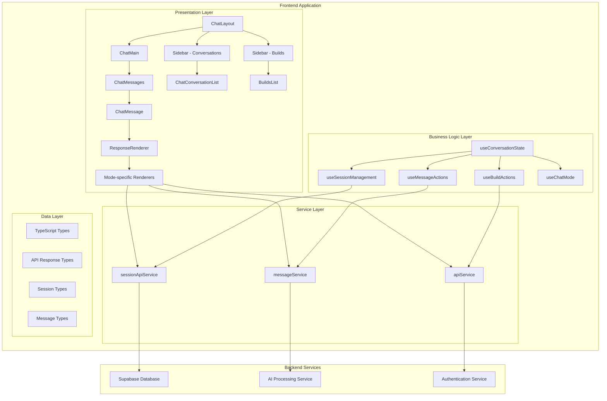

### 2.2 컴포넌트 계층 구조 (Component Hierarchy)

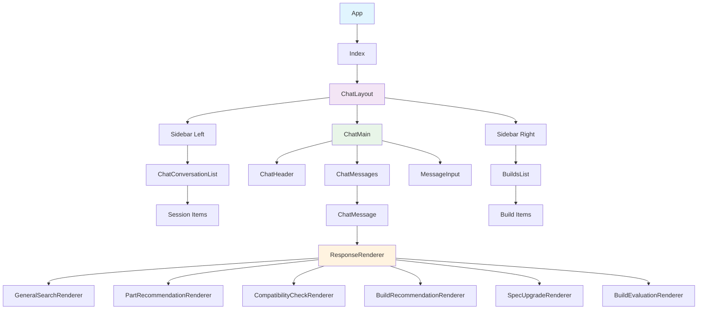

### 2.3 데이터 흐름 아키텍처 (Data Flow Architecture)

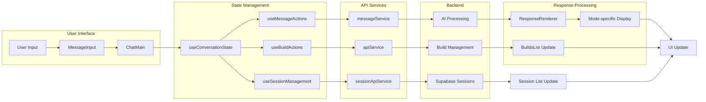

## 3. 컴포넌트 클래스 다이어그램 (Component Class Diagrams)

### 3.1 Core Components Class Diagram

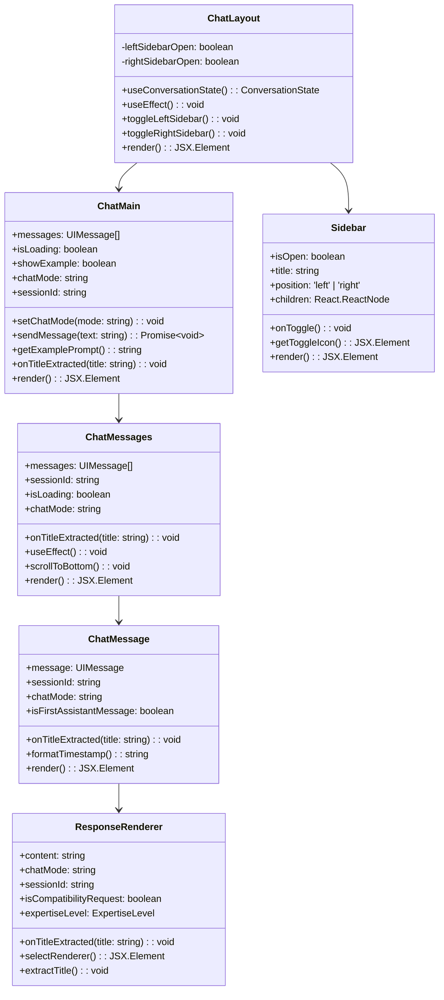

### 3.2 Hooks Class Diagram

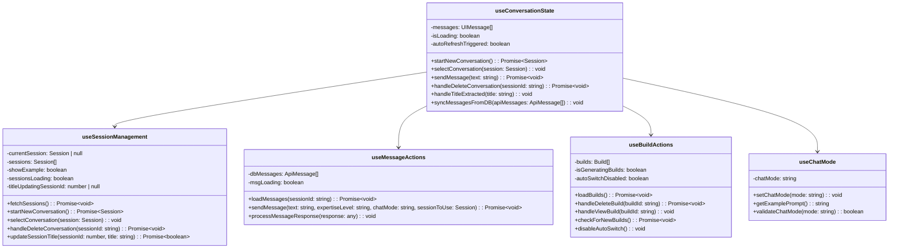

### 3.3 Service Layer Class Diagram

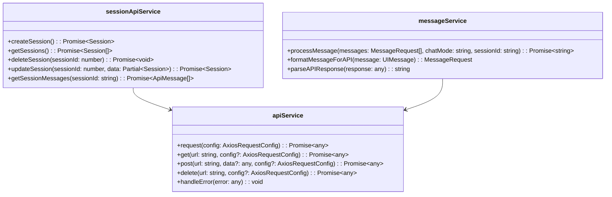

## 4. 시퀀스 다이어그램 (Sequence Diagrams)

### 4.1 세션 생성 및 첫 메시지 전송 시퀀스

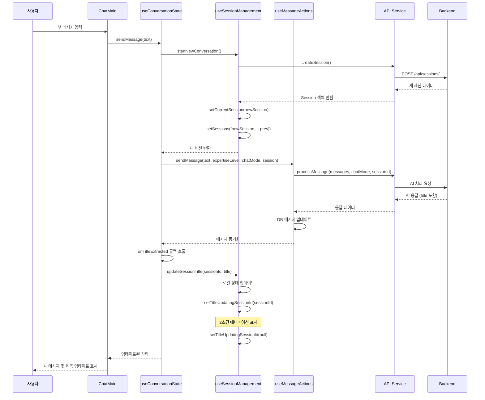

### 4.2 응답 렌더링 및 제목 추출 시퀀스

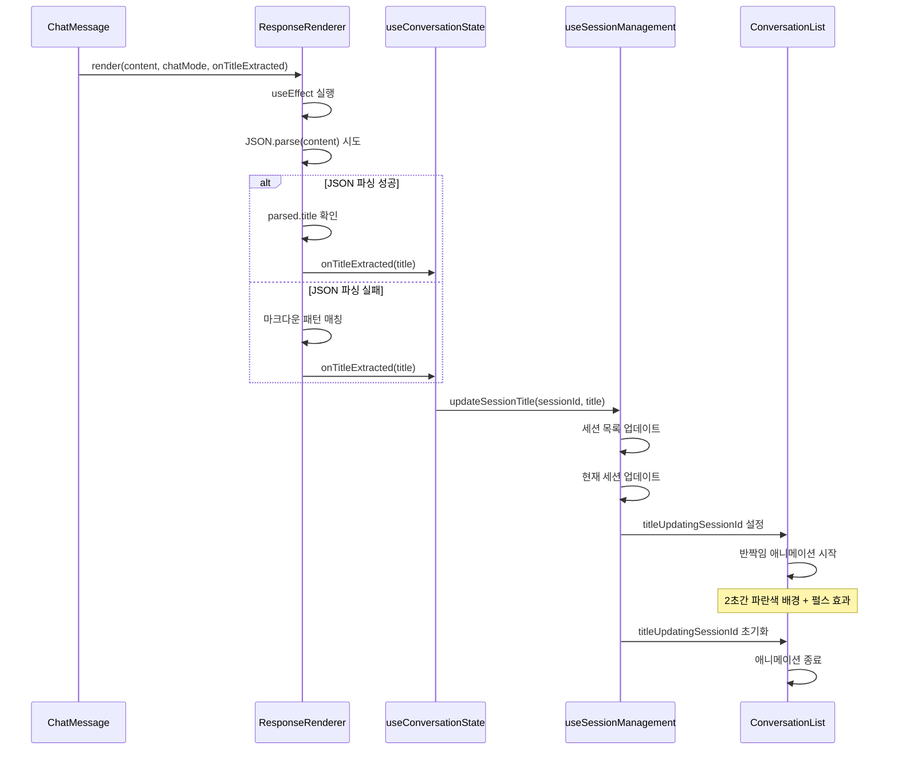

### 4.3 세션 관리 시퀀스

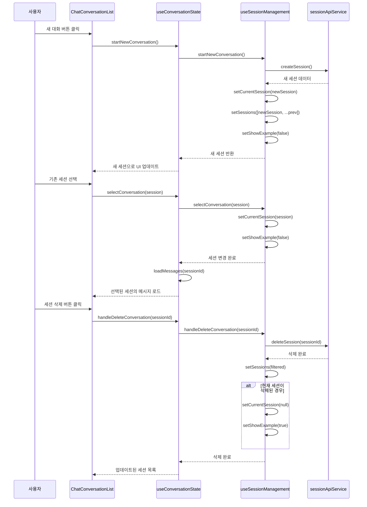

## 5. 데이터 타입 정의 (Data Type Definitions)

### 5.1 Core Data Types

```typescript
// 세션 관련 타입
interface Session {
  id: number;
  session_name: string;
  last_modified: string;
  messages: any[];
}

// API 메시지 타입 (백엔드 응답)
interface ApiMessage {
  content: string;
  role: 'user' | 'assistant';
  mode: string;
  id: number;
  session_id: number;
  created_at: string;
}

// UI 메시지 타입 (프론트엔드 사용)
interface UIMessage {
  text: string;
  isUser: boolean;
  chatMode?: string;
  expertiseLevel?: 'beginner' | 'intermediate' | 'expert';
}

// 메시지 요청 타입
interface MessageRequest {
  role: string;
  content: string;
}
```

### 5.2 Response Types

```typescript
// 범용 검색 응답
interface GeneralSearchResponse {
  content: string;
  expertiseLevel: 'beginner' | 'intermediate' | 'expert';
}

// 부품 추천 응답
interface PartRecommendationResponse {
  parts: {
    [key: string]: {
      name: string;
      reason: string;
      price: string;
      specs: string;
      link: string;
      image_url: string;
    };
  };
  suggestion: string;
}

// 호환성 검사 응답
interface CompatibilityCheckResponse {
  components: string[];
  [key: string]: boolean | string | string[] | null;
  edge_case?: boolean;
  edge_reason?: string;
  suggestion?: string;
}

// 견적 추천 응답
interface BuildRecommendationResponse {
  title: string;
  parts: {
    [key: string]: {
      name: string;
      price: string;
      specs: string;
      reason: string;
      link: string;
      image_url: string;
    };
  };
  total_price: string;
  total_reason: string;
  suggestion: string;
}

// 견적 평가 응답
interface BuildEvaluationResponse {
  performance: {
    score: number;
    comment: string;
  };
  price_performance: {
    score: number;
    comment: string;
  };
  expandability: {
    score: number;
    comment: string;
  };
  noise: {
    score: number;
    comment: string;
  };
  average_score: number;
  suggestion?: string;
}
```

### 5.3 Build and Component Types

```typescript
// 견적 타입
interface Build {
  id: number;
  created_at: string;
  name: string;
  session_id: number;
  total_price: number;
  parts: any;
  components: any[];
  recommendation: string;
  rating?: any;
}

// 컴포넌트 세부사항
interface PartDetail {
  name: string;
  price: string;
  specs: string;
  reason: string;
  link: string;
  image?: string;
  image_url?: string;
}

// 견적 데이터
interface BuildData {
  title: string;
  parts: PartDetail[] | Record<string, PartDetail>;
  total_price: string;
  total_reason: string;
  suggestion?: string;
}

// 호환성 데이터
interface CompatibilityData {
  [key: string]: boolean | string | string[] | undefined;
  components?: string[];
}
```

### 5.4 Hook State Types

```typescript
// 대화 상태 타입
interface ConversationState {
  // 세션 관리
  currentConversation: Session | null;
  conversations: Session[];
  convoLoading: boolean;
  titleUpdatingSessionId: number | null;

  // 메시지 관리
  messages: UIMessage[];
  dbMessages: ApiMessage[];
  isLoading: boolean;
  msgLoading: boolean;

  // 견적 관리
  builds: Build[];
  buildsLoading: boolean;
  isGeneratingBuilds: boolean;

  // UI 상태
  showExample: boolean;
  chatMode: string;
  autoSwitchDisabled: boolean;
  sessionId?: string;
}

// 컴포넌트 Props 타입
interface SidebarProps {
  isOpen: boolean;
  onToggle: () => void;
  title: string;
  position: 'left' | 'right';
  children: React.ReactNode;
}

interface ChatMainProps {
  messages: UIMessage[];
  isLoading: boolean;
  showExample: boolean;
  chatMode: string;
  setChatMode: (mode: string) => void;
  sendMessage: (text: string) => Promise<void>;
  getExamplePrompt: () => string;
  sessionId?: string;
  onTitleExtracted?: (title: string) => void;
}
```

## 6. 상태 관리 아키텍처 (State Management Architecture)

### 6.1 상태 흐름 다이어그램

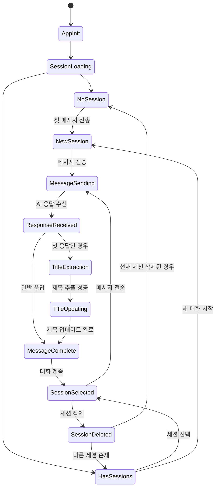

### 6.2 Hook 의존성 그래프

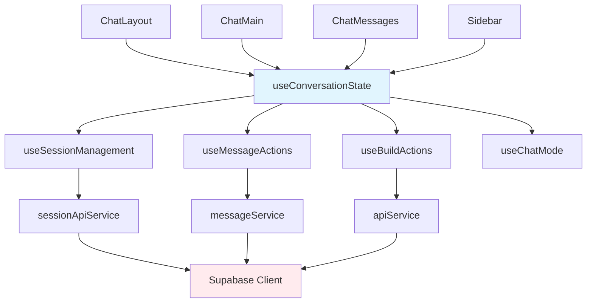

## 7. API 통신 아키텍처 (API Communication Architecture)

### 7.1 API 엔드포인트 매핑

```mermaid
graph LR
    subgraph "Frontend Services"
        A[sessionApiService]
        B[messageService]
        C[apiService]
    end
    
    subgraph "API Endpoints"
        D[POST /api/sessions/]
        E[GET /api/sessions]
        F[GET /api/{sessionId}/messages/]
        G[DELETE /api/sessions/{sessionId}]
        H[POST /chat-completion]
    end
    
    subgraph "Backend Services"
        I[Session Management]
        J[Message Processing]
        K[AI Integration]
    end
    
    A --> D
    A --> E
    A --> F
    A --> G
    B --> H
    
    D --> I
    E --> I
    F --> I
    G --> I
    H --> J
    J --> K
```

### 7.2 에러 처리 플로우

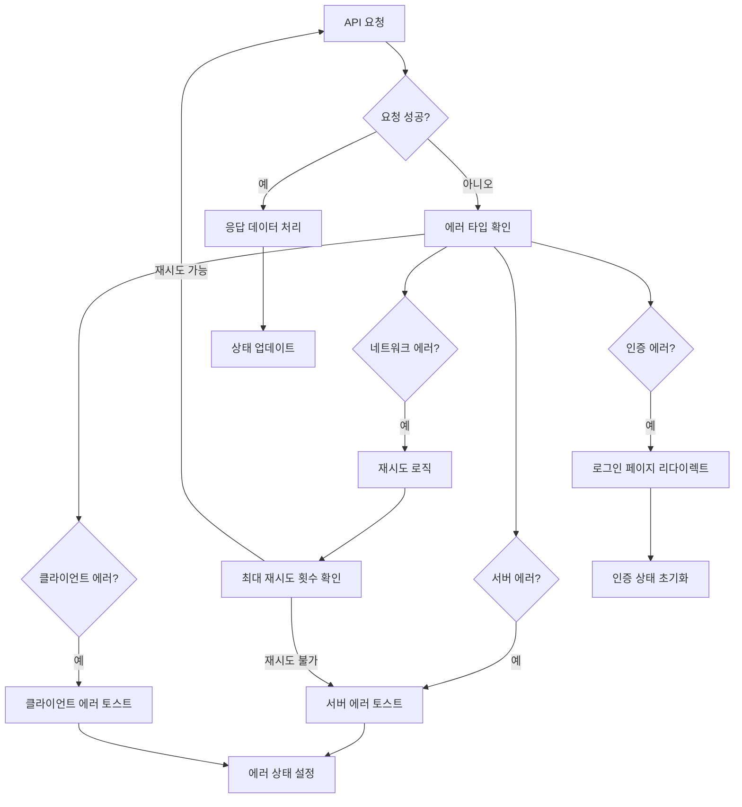

## 8. 컴포넌트 라이프사이클 (Component Lifecycle)

### 8.1 ChatLayout 라이프사이클

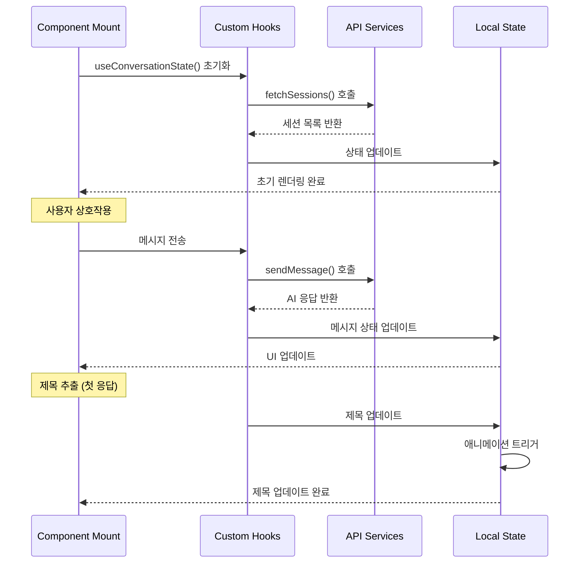

## 9. 성능 최적화 전략 (Performance Optimization)

### 9.1 렌더링 최적화

- **React.memo**: 불필요한 리렌더링 방지
- **useCallback**: 함수 메모이제이션
- **useMemo**: 계산 결과 메모이제이션
- **지연 로딩**: 큰 컴포넌트의 동적 임포트

### 9.2 상태 최적화

- **로컬 상태 분리**: 전역 상태와 로컬 상태 적절한 분리
- **낙관적 업데이트**: 사용자 경험 향상을 위한 즉시 UI 업데이트
- **배치 업데이트**: 여러 상태 변경을 하나로 묶어 처리

### 9.3 네트워크 최적화

- **요청 캐싱**: 중복 API 요청 방지
- **요청 병합**: 동시 요청 최적화
- **에러 재시도**: 네트워크 불안정 상황 대응

## 10. 보안 고려사항 (Security Considerations)

### 10.1 데이터 보호
- 사용자 입력 검증 및 새니타이징
- XSS 방지를 위한 안전한 렌더링
- 민감한 데이터 로컬 저장 금지

### 10.2 API 보안
- HTTPS 통신 강제
- 적절한 에러 메시지 처리
- 세션 관리 보안

### 10.3 인증 및 권한
- Supabase 인증 시스템 활용
- 세션 기반 권한 관리
- API 키 보안 관리

## 11. 테스트 전략 (Testing Strategy)

### 11.1 단위 테스트
- 개별 컴포넌트 테스트
- 커스텀 훅 테스트
- 유틸리티 함수 테스트

### 11.2 통합 테스트
- 컴포넌트 간 상호작용 테스트
- API 통신 테스트
- 상태 관리 테스트

### 11.3 E2E 테스트
- 사용자 플로우 테스트
- 크로스 브라우저 테스트
- 반응형 디자인 테스트

이 Design Specification은 PC 견적 AI 어시스턴트 Frontend의 전체적인 구조와 설계 원칙을 제시하며, 개발팀이 일관된 방향으로 개발을 진행할 수 있도록 상세한 가이드라인을 제공합니다.
