# PC 견적 AI 어시스턴트 Frontend - Design Specification

## 1. 프로젝트 개요 (Project Overview)

### 1.1 목표 (Objectives)
- **주요 목표**: 사용자가 원하는 용도에 맞는 컴퓨터 견적을 AI를 통해 추천받을 수 있는 웹 애플리케이션
- **사용자 경험**: 직관적이고 반응형인 채팅 인터페이스를 통한 견적 상담
- **기능적 목표**:
  - 실시간 채팅 기반 견적 상담
  - 다양한 모드별 전문 상담 (범용 검색, 부품 추천, 호환성 검사, 견적 추천, 스펙 업그레이드, 견적 평가)
  - 세션 기반 대화 관리
  - 생성된 견적 목록 관리 및 조회
  - 첫 응답 기반 자동 세션 제목 생성
  - 견적 상세 정보 보기 및 관리

### 1.2 기술 스택 (Technology Stack)
- **Frontend Framework**: React 18 with TypeScript
- **Build Tool**: Vite
- **Styling**: Tailwind CSS + shadcn/ui components
- **State Management**: React Hooks (useState, useEffect, custom hooks)
- **HTTP Client**: Axios
- **Routing**: React Router DOM
- **Icons**: Lucide React
- **Backend Integration**: REST API

## 2. 시스템 아키텍처 (System Architecture)

### 2.1 전체 시스템 아키텍처 (Overall System Architecture)

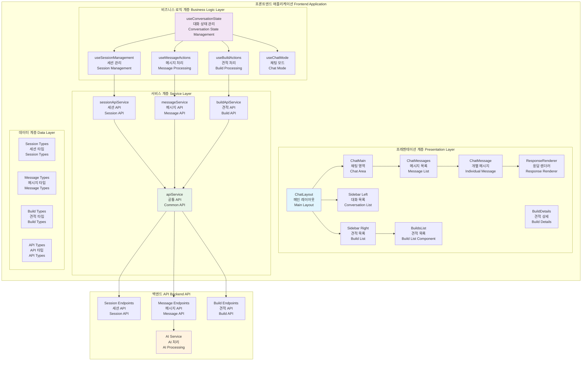
```mermaid
graph TB
    subgraph "프론트엔드 애플리케이션 Frontend Application"
        subgraph "프레젠테이션 계층 Presentation Layer"
            ChatLayout["ChatLayout<br/>메인 레이아웃<br/>Main Layout"]
            ChatMain["ChatMain<br/>채팅 영역<br/>Chat Area"]
            SidebarLeft["Sidebar Left<br/>대화 목록<br/>Conversation List"]
            SidebarRight["Sidebar Right<br/>견적 목록<br/>Build List"]
            ChatMessages["ChatMessages<br/>메시지 목록<br/>Message List"]
            ChatMessage["ChatMessage<br/>개별 메시지<br/>Individual Message"]
            ResponseRenderer["ResponseRenderer<br/>응답 렌더러<br/>Response Renderer"]
            BuildsList["BuildsList<br/>견적 목록<br/>Build List Component"]
            BuildDetails["BuildDetails<br/>견적 상세<br/>Build Details"]
        end
        
        subgraph "비즈니스 로직 계층 Business Logic Layer"
            ConversationState["useConversationState<br/>대화 상태 관리<br/>Conversation State Management"]
            SessionManagement["useSessionManagement<br/>세션 관리<br/>Session Management"]
            MessageActions["useMessageActions<br/>메시지 처리<br/>Message Processing"]
            BuildActions["useBuildActions<br/>견적 처리<br/>Build Processing"]
            ChatMode["useChatMode<br/>채팅 모드<br/>Chat Mode"]
        end
        
        subgraph "서비스 계층 Service Layer"
            SessionAPI["sessionApiService<br/>세션 API<br/>Session API"]
            MessageService["messageService<br/>메시지 API<br/>Message API"]
            BuildService["buildApiService<br/>견적 API<br/>Build API"]
            APIService["apiService<br/>공통 API<br/>Common API"]
        end
        
        subgraph "데이터 계층 Data Layer"
            SessionTypes["Session Types<br/>세션 타입<br/>Session Types"]
            MessageTypes["Message Types<br/>메시지 타입<br/>Message Types"]
            BuildTypes["Build Types<br/>견적 타입<br/>Build Types"]
            APITypes["API Types<br/>API 타입<br/>API Types"]
        end
    end
    
    subgraph "백엔드 API Backend API"
        SessionEndpoints["Session Endpoints<br/>세션 API<br/>Session API"]
        MessageEndpoints["Message Endpoints<br/>메시지 API<br/>Message API"]
        BuildEndpoints["Build Endpoints<br/>견적 API<br/>Build API"]
        AIService["AI Service<br/>AI 처리<br/>AI Processing"]
    end
    
    ChatLayout --> ChatMain
    ChatLayout --> SidebarLeft
    ChatLayout --> SidebarRight
    ChatMain --> ChatMessages
    ChatMessages --> ChatMessage
    ChatMessage --> ResponseRenderer
    SidebarRight --> BuildsList
    
    ConversationState --> SessionManagement
    ConversationState --> MessageActions
    ConversationState --> BuildActions
    ConversationState --> ChatMode
    
    SessionManagement --> SessionAPI
    MessageActions --> MessageService
    BuildActions --> BuildService
    
    SessionAPI --> APIService
    MessageService --> APIService
    BuildService --> APIService
    
    APIService --> SessionEndpoints
    APIService --> MessageEndpoints
    APIService --> BuildEndpoints
    
    MessageEndpoints --> AIService
    
    style ChatLayout fill:#e1f5fe
    style ConversationState fill:#f3e5f5
    style APIService fill:#e8f5e8
    style AIService fill:#fff3e0
```

### 2.2 컴포넌트 계층 구조 (Component Hierarchy)

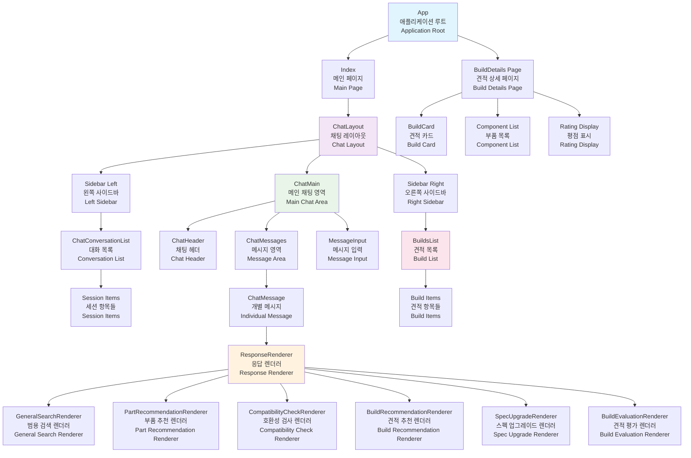
```mermaid
graph TD
    App["App<br/>애플리케이션 루트<br/>Application Root"] --> Index["Index<br/>메인 페이지<br/>Main Page"]
    App --> BuildDetailsPage["BuildDetails Page<br/>견적 상세 페이지<br/>Build Details Page"]
    
    Index --> ChatLayout["ChatLayout<br/>채팅 레이아웃<br/>Chat Layout"]
    
    ChatLayout --> SidebarLeft["Sidebar Left<br/>왼쪽 사이드바<br/>Left Sidebar"]
    ChatLayout --> ChatMainArea["ChatMain<br/>메인 채팅 영역<br/>Main Chat Area"]
    ChatLayout --> SidebarRight["Sidebar Right<br/>오른쪽 사이드바<br/>Right Sidebar"]
    
    SidebarLeft --> ConversationList["ChatConversationList<br/>대화 목록<br/>Conversation List"]
    ConversationList --> SessionItem["Session Items<br/>세션 항목들<br/>Session Items"]
    
    ChatMainArea --> ChatHeader["ChatHeader<br/>채팅 헤더<br/>Chat Header"]
    ChatMainArea --> ChatMessages["ChatMessages<br/>메시지 영역<br/>Message Area"]
    ChatMainArea --> MessageInput["MessageInput<br/>메시지 입력<br/>Message Input"]
    
    ChatMessages --> ChatMessage["ChatMessage<br/>개별 메시지<br/>Individual Message"]
    ChatMessage --> ResponseRenderer["ResponseRenderer<br/>응답 렌더러<br/>Response Renderer"]
    
    ResponseRenderer --> GeneralSearch["GeneralSearchRenderer<br/>범용 검색 렌더러<br/>General Search Renderer"]
    ResponseRenderer --> PartRecommendation["PartRecommendationRenderer<br/>부품 추천 렌더러<br/>Part Recommendation Renderer"]
    ResponseRenderer --> CompatibilityCheck["CompatibilityCheckRenderer<br/>호환성 검사 렌더러<br/>Compatibility Check Renderer"]
    ResponseRenderer --> BuildRecommendation["BuildRecommendationRenderer<br/>견적 추천 렌더러<br/>Build Recommendation Renderer"]
    ResponseRenderer --> SpecUpgrade["SpecUpgradeRenderer<br/>스펙 업그레이드 렌더러<br/>Spec Upgrade Renderer"]
    ResponseRenderer --> BuildEvaluation["BuildEvaluationRenderer<br/>견적 평가 렌더러<br/>Build Evaluation Renderer"]
    
    SidebarRight --> BuildsList["BuildsList<br/>견적 목록<br/>Build List"]
    BuildsList --> BuildItem["Build Items<br/>견적 항목들<br/>Build Items"]
    
    BuildDetailsPage --> BuildCard["BuildCard<br/>견적 카드<br/>Build Card"]
    BuildDetailsPage --> ComponentList["Component List<br/>부품 목록<br/>Component List"]
    BuildDetailsPage --> RatingDisplay["Rating Display<br/>평점 표시<br/>Rating Display"]
    
    style App fill:#e1f5fe
    style ChatLayout fill:#f3e5f5
    style ChatMainArea fill:#e8f5e8
    style ResponseRenderer fill:#fff3e0
    style BuildsList fill:#fce4ec
```

### 2.3 견적 관리 아키텍처 (Build Management Architecture)

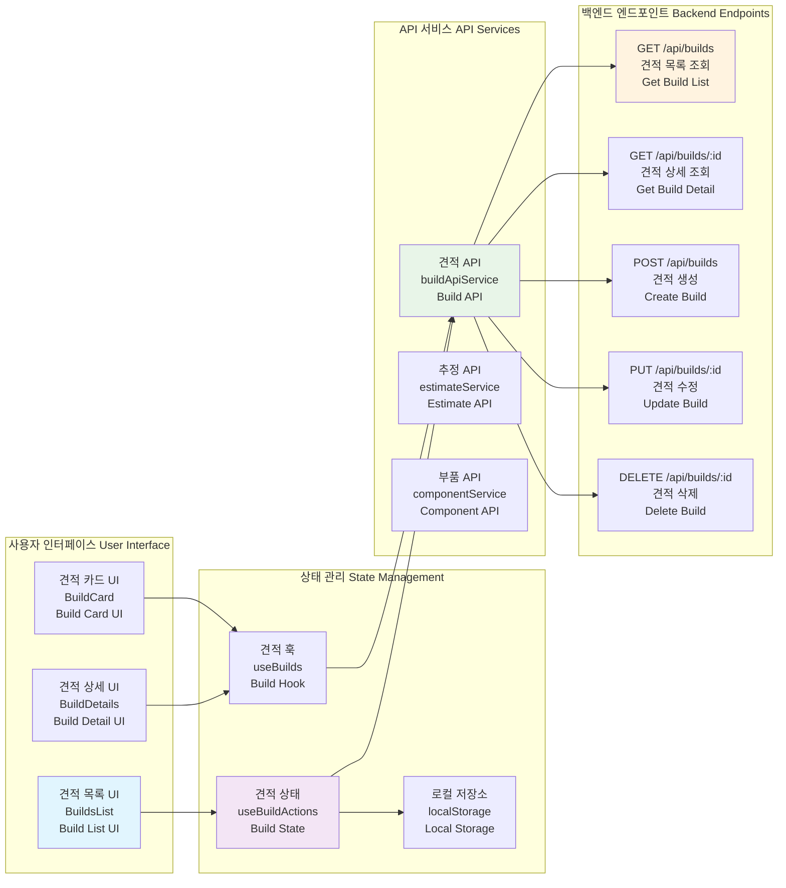
```mermaid
graph LR
    subgraph "사용자 인터페이스 User Interface"
        BuildListUI["견적 목록 UI<br/>BuildsList<br/>Build List UI"]
        BuildDetailUI["견적 상세 UI<br/>BuildDetails<br/>Build Detail UI"]
        BuildCardUI["견적 카드 UI<br/>BuildCard<br/>Build Card UI"]
    end
    
    subgraph "상태 관리 State Management"
        BuildState["견적 상태<br/>useBuildActions<br/>Build State"]
        BuildHook["견적 훅<br/>useBuilds<br/>Build Hook"]
        LocalStorage["로컬 저장소<br/>localStorage<br/>Local Storage"]
    end
    
    subgraph "API 서비스 API Services"
        BuildAPI["견적 API<br/>buildApiService<br/>Build API"]
        EstimateAPI["추정 API<br/>estimateService<br/>Estimate API"]
        ComponentAPI["부품 API<br/>componentService<br/>Component API"]
    end
    
    subgraph "백엔드 엔드포인트 Backend Endpoints"
        GetBuilds["GET /api/builds<br/>견적 목록 조회<br/>Get Build List"]
        GetBuild["GET /api/builds/:id<br/>견적 상세 조회<br/>Get Build Detail"]
        CreateBuild["POST /api/builds<br/>견적 생성<br/>Create Build"]
        UpdateBuild["PUT /api/builds/:id<br/>견적 수정<br/>Update Build"]
        DeleteBuild["DELETE /api/builds/:id<br/>견적 삭제<br/>Delete Build"]
    end
    
    BuildListUI --> BuildState
    BuildDetailUI --> BuildHook
    BuildCardUI --> BuildHook
    
    BuildState --> BuildAPI
    BuildHook --> BuildAPI
    BuildState --> LocalStorage
    
    BuildAPI --> GetBuilds
    BuildAPI --> GetBuild
    BuildAPI --> CreateBuild
    BuildAPI --> UpdateBuild
    BuildAPI --> DeleteBuild
    
    style BuildListUI fill:#e1f5fe
    style BuildState fill:#f3e5f5
    style BuildAPI fill:#e8f5e8
    style GetBuilds fill:#fff3e0
```

### 2.4 데이터 흐름 아키텍처 (Data Flow Architecture)

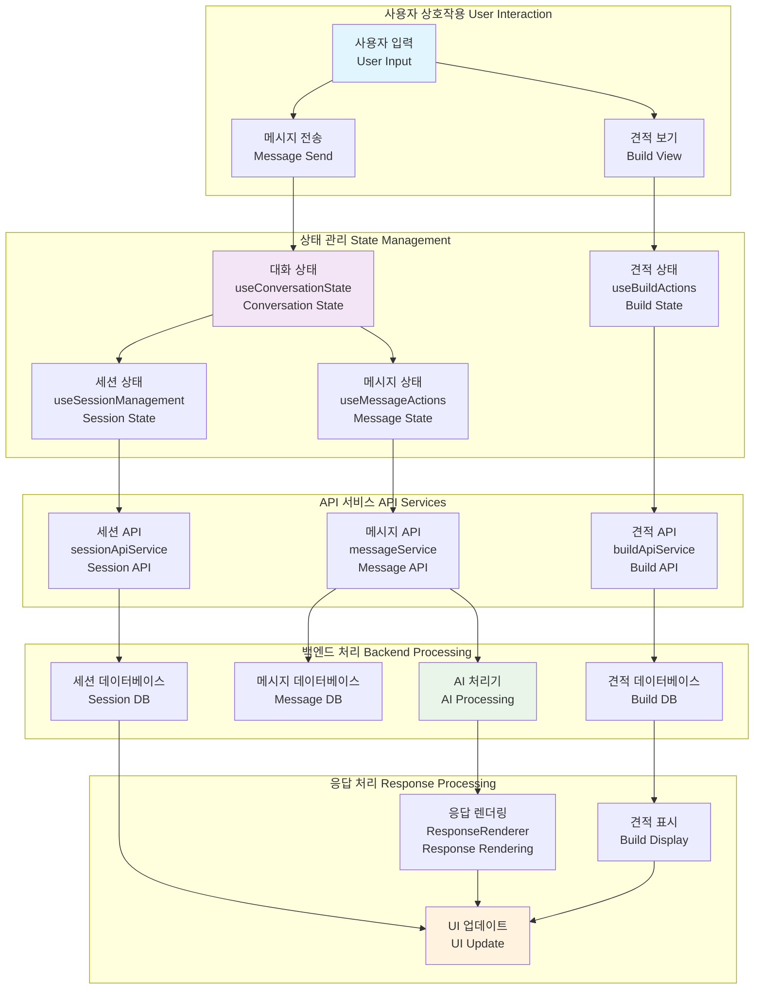
```mermaid
graph TB
    subgraph "사용자 상호작용 User Interaction"
        UserInput["사용자 입력<br/>User Input"]
        MessageSend["메시지 전송<br/>Message Send"]
        BuildView["견적 보기<br/>Build View"]
    end
    
    subgraph "상태 관리 State Management"
        ConversationState["대화 상태<br/>useConversationState<br/>Conversation State"]
        SessionState["세션 상태<br/>useSessionManagement<br/>Session State"]
        MessageState["메시지 상태<br/>useMessageActions<br/>Message State"]
        BuildState["견적 상태<br/>useBuildActions<br/>Build State"]
    end
    
    subgraph "API 서비스 API Services"
        SessionAPI["세션 API<br/>sessionApiService<br/>Session API"]
        MessageAPI["메시지 API<br/>messageService<br/>Message API"]
        BuildAPI["견적 API<br/>buildApiService<br/>Build API"]
    end
    
    subgraph "백엔드 처리 Backend Processing"
        SessionDB["세션 데이터베이스<br/>Session DB"]
        MessageDB["메시지 데이터베이스<br/>Message DB"]
        BuildDB["견적 데이터베이스<br/>Build DB"]
        AIProcessor["AI 처리기<br/>AI Processing"]
    end
    
    subgraph "응답 처리 Response Processing"
        ResponseRender["응답 렌더링<br/>ResponseRenderer<br/>Response Rendering"]
        BuildDisplay["견적 표시<br/>Build Display"]
        UIUpdate["UI 업데이트<br/>UI Update"]
    end
    
    UserInput --> MessageSend
    UserInput --> BuildView
    
    MessageSend --> ConversationState
    BuildView --> BuildState
    
    ConversationState --> SessionState
    ConversationState --> MessageState
    
    SessionState --> SessionAPI
    MessageState --> MessageAPI
    BuildState --> BuildAPI
    
    SessionAPI --> SessionDB
    MessageAPI --> MessageDB
    MessageAPI --> AIProcessor
    BuildAPI --> BuildDB
    
    AIProcessor --> ResponseRender
    BuildDB --> BuildDisplay
    
    ResponseRender --> UIUpdate
    BuildDisplay --> UIUpdate
    
    SessionDB --> UIUpdate
    
    style UserInput fill:#e1f5fe
    style ConversationState fill:#f3e5f5
    style AIProcessor fill:#e8f5e8
    style UIUpdate fill:#fff3e0
```

## 3. 컴포넌트 클래스 다이어그램 (Component Class Diagrams)

### 3.1 Core Components Class Diagram

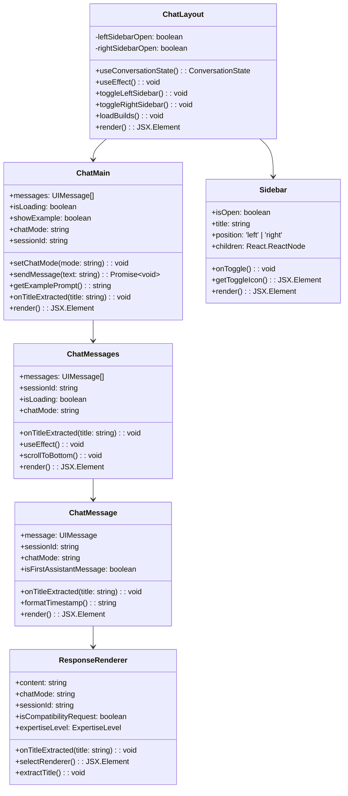
```mermaid
classDiagram
    class ChatLayout {
        -leftSidebarOpen: boolean
        -rightSidebarOpen: boolean
        +useConversationState(): ConversationState
        +useEffect(): void
        +toggleLeftSidebar(): void
        +toggleRightSidebar(): void
        +loadBuilds(): void
        +render(): JSX.Element
    }

    class ChatMain {
        +messages: UIMessage[]
        +isLoading: boolean
        +showExample: boolean
        +chatMode: string
        +setChatMode(mode: string): void
        +sendMessage(text: string): Promise~void~
        +getExamplePrompt(): string
        +sessionId: string
        +onTitleExtracted(title: string): void
        +render(): JSX.Element
    }

    class ChatMessages {
        +messages: UIMessage[]
        +sessionId: string
        +isLoading: boolean
        +chatMode: string
        +onTitleExtracted(title: string): void
        +useEffect(): void
        +scrollToBottom(): void
        +render(): JSX.Element
    }

    class ChatMessage {
        +message: UIMessage
        +sessionId: string
        +chatMode: string
        +onTitleExtracted(title: string): void
        +isFirstAssistantMessage: boolean
        +formatTimestamp(): string
        +render(): JSX.Element
    }

    class Sidebar {
        +isOpen: boolean
        +onToggle(): void
        +title: string
        +position: 'left' | 'right'
        +children: React.ReactNode
        +getToggleIcon(): JSX.Element
        +render(): JSX.Element
    }

    class ResponseRenderer {
        +content: string
        +chatMode: string
        +sessionId: string
        +isCompatibilityRequest: boolean
        +expertiseLevel: ExpertiseLevel
        +onTitleExtracted(title: string): void
        +selectRenderer(): JSX.Element
        +extractTitle(): void
    }

    ChatLayout --> ChatMain
    ChatLayout --> Sidebar
    ChatMain --> ChatMessages
    ChatMessages --> ChatMessage
    ChatMessage --> ResponseRenderer
```

### 3.2 Build Components Class Diagram

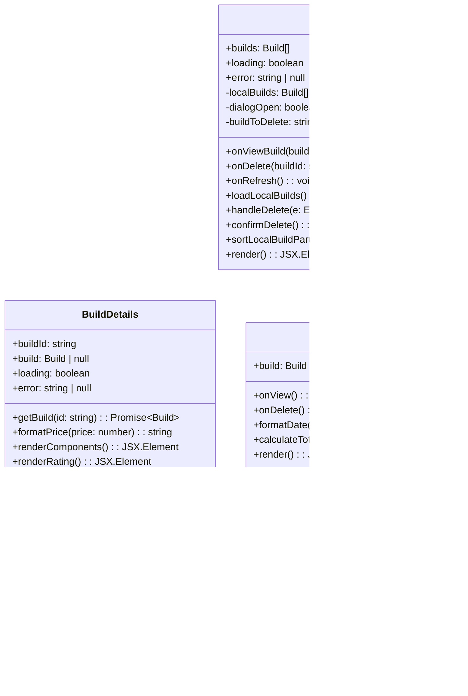
```mermaid
classDiagram
    class BuildsList {
        +builds: Build[]
        +loading: boolean
        +error: string | null
        +onViewBuild(buildId: string): void
        +onDelete(buildId: string): void
        +onRefresh(): void
        -localBuilds: Build[]
        -dialogOpen: boolean
        -buildToDelete: string | null
        +loadLocalBuilds(): void
        +handleDelete(e: Event, buildId: string): void
        +confirmDelete(): void
        +sortLocalBuildParts(build: Build): Build
        +render(): JSX.Element
    }

    class BuildDetails {
        +buildId: string
        +build: Build | null
        +loading: boolean
        +error: string | null
        +getBuild(id: string): Promise~Build~
        +formatPrice(price: number): string
        +renderComponents(): JSX.Element
        +renderRating(): JSX.Element
        +render(): JSX.Element
    }

    class BuildCard {
        +build: Build
        +onView(): void
        +onDelete(): void
        +formatDate(date: string): string
        +calculateTotalPrice(): number
        +render(): JSX.Element
    }

    class RatingIndicator {
        +rating: number
        +maxRating: number
        +label: string
        +size: 'sm' | 'md' | 'lg'
        +color: string
        +renderStars(): JSX.Element
        +render(): JSX.Element
    }

    BuildsList --> BuildCard
    BuildDetails --> RatingIndicator
    BuildCard --> RatingIndicator
```

### 3.3 Hooks Class Diagram

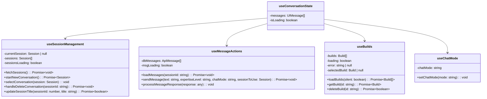
```mermaid
classDiagram
    class useConversationState {
        -messages: UIMessage[]
        -isLoading: boolean
    }

    class useSessionManagement {
        -currentSession: Session | null
        -sessions: Session[]
        -sessionsLoading: boolean
        +fetchSessions(): Promise~void~
        +startNewConversation(): Promise~Session~
        +selectConversation(session: Session): void
        +handleDeleteConversation(sessionId: string): Promise~void~
        +updateSessionTitle(sessionId: number, title: string): Promise~boolean~
    }

    class useMessageActions {
        -dbMessages: ApiMessage[]
        -msgLoading: boolean
        +loadMessages(sessionId: string): Promise~void~
        +sendMessage(text: string, expertiseLevel: string, chatMode: string, sessionToUse: Session): Promise~void~
        +processMessageResponse(response: any): void
    }

    class useBuilds {
        -builds: Build[]
        -loading: boolean
        -error: string | null
        -selectedBuild: Build | null
        +loadBuilds(silent: boolean): Promise~Build[]~
        +getBuild(id: string): Promise~Build~
        +deleteBuild(id: string): Promise~boolean~
    }

    class useChatMode {
        -chatMode: string
        +setChatMode(mode: string): void
    }

    useConversationState --> useSessionManagement
    useConversationState --> useMessageActions
    useConversationState --> useBuilds
    useConversationState --> useChatMode
```

### 3.4 Service Layer Class Diagram

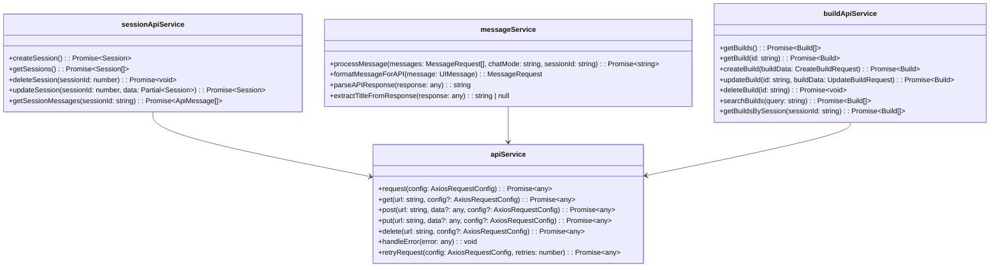
```mermaid
classDiagram
    direction TB
    
    class sessionApiService {
        +createSession(): Promise~Session~
        +getSessions(): Promise~Session[]~
        +deleteSession(sessionId: number): Promise~void~
        +updateSession(sessionId: number, data: Partial~Session~): Promise~Session~
        +getSessionMessages(sessionId: string): Promise~ApiMessage[]~
    }

    class messageService {
        +processMessage(messages: MessageRequest[], chatMode: string, sessionId: string): Promise~string~
        +formatMessageForAPI(message: UIMessage): MessageRequest
        +parseAPIResponse(response: any): string
        +extractTitleFromResponse(response: any): string | null
    }

    class buildApiService {
        +getBuilds(): Promise~Build[]~
        +getBuild(id: string): Promise~Build~
        +createBuild(buildData: CreateBuildRequest): Promise~Build~
        +updateBuild(id: string, buildData: UpdateBuildRequest): Promise~Build~
        +deleteBuild(id: string): Promise~void~
        +searchBuilds(query: string): Promise~Build[]~
        +getBuildsBySession(sessionId: string): Promise~Build[]~
    }

    class apiService {
        +request(config: AxiosRequestConfig): Promise~any~
        +get(url: string, config?: AxiosRequestConfig): Promise~any~
        +post(url: string, data?: any, config?: AxiosRequestConfig): Promise~any~
        +put(url: string, data?: any, config?: AxiosRequestConfig): Promise~any~
        +delete(url: string, config?: AxiosRequestConfig): Promise~any~
        +handleError(error: any): void
        +retryRequest(config: AxiosRequestConfig, retries: number): Promise~any~
    }

    sessionApiService --> apiService
    messageService --> apiService
    buildApiService --> apiService
```

## 4. 시퀀스 다이어그램 (Sequence Diagrams)

### 4.1 세션 생성 및 첫 메시지 전송 시퀀스

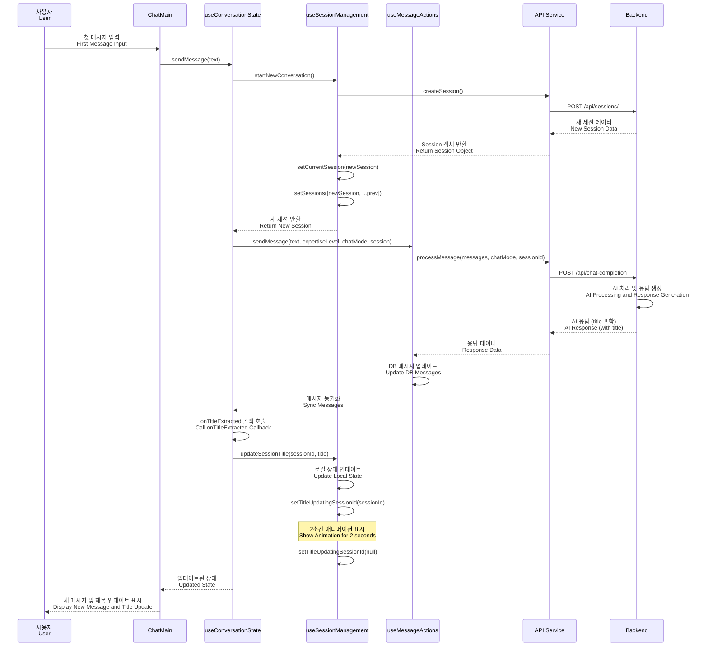
```mermaid
sequenceDiagram
    participant User as 사용자<br/>User
    participant UI as ChatMain
    participant State as useConversationState
    participant Session as useSessionManagement
    participant Message as useMessageActions
    participant API as API Service
    participant Backend as Backend

    User->>UI: 첫 메시지 입력<br/>First Message Input
    UI->>State: sendMessage(text)
    State->>Session: startNewConversation()
    Session->>API: createSession()
    API->>Backend: POST /api/sessions/
    Backend-->>API: 새 세션 데이터<br/>New Session Data
    API-->>Session: Session 객체 반환<br/>Return Session Object
    Session->>Session: setCurrentSession(newSession)
    Session->>Session: setSessions([newSession, ...prev])
    Session-->>State: 새 세션 반환<br/>Return New Session
    
    State->>Message: sendMessage(text, expertiseLevel, chatMode, session)
    Message->>API: processMessage(messages, chatMode, sessionId)
    API->>Backend: POST /api/chat-completion
    Backend->>Backend: AI 처리 및 응답 생성<br/>AI Processing and Response Generation
    Backend-->>API: AI 응답 (title 포함)<br/>AI Response (with title)
    API-->>Message: 응답 데이터<br/>Response Data
    Message->>Message: DB 메시지 업데이트<br/>Update DB Messages
    Message-->>State: 메시지 동기화<br/>Sync Messages
    
    State->>State: onTitleExtracted 콜백 호출<br/>Call onTitleExtracted Callback
    State->>Session: updateSessionTitle(sessionId, title)
    Session->>Session: 로컬 상태 업데이트<br/>Update Local State
    Session->>Session: setTitleUpdatingSessionId(sessionId)
    
    Note over Session: 2초간 애니메이션 표시<br/>Show Animation for 2 seconds
    Session->>Session: setTitleUpdatingSessionId(null)
    
    State-->>UI: 업데이트된 상태<br/>Updated State
    UI-->>User: 새 메시지 및 제목 업데이트 표시<br/>Display New Message and Title Update
```

### 4.2 견적 생성 및 관리 시퀀스

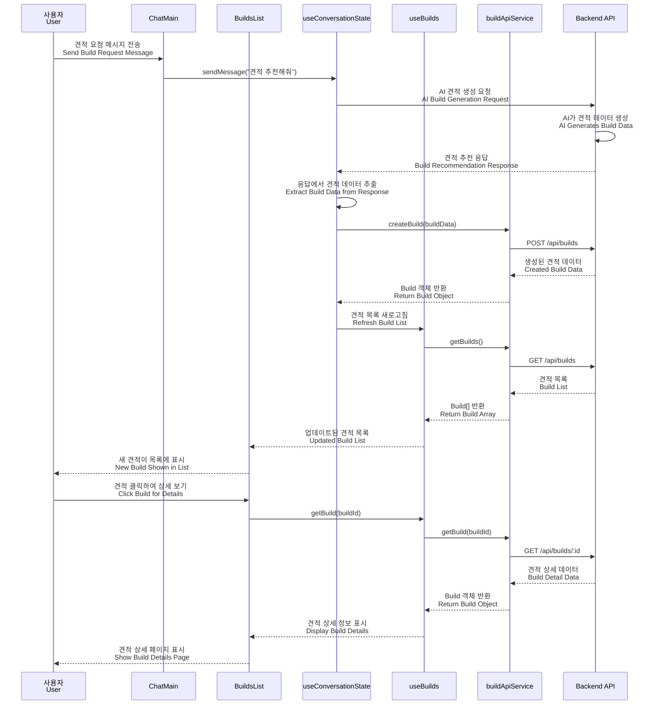
```mermaid
sequenceDiagram
    participant User as 사용자<br/>User
    participant ChatUI as ChatMain
    participant BuildUI as BuildsList
    participant State as useConversationState
    participant BuildHook as useBuilds
    participant BuildAPI as buildApiService
    participant Backend as Backend API

    User->>ChatUI: 견적 요청 메시지 전송<br/>Send Build Request Message
    ChatUI->>State: sendMessage("견적 추천해줘")
    State->>Backend: AI 견적 생성 요청<br/>AI Build Generation Request
    Backend->>Backend: AI가 견적 데이터 생성<br/>AI Generates Build Data
    Backend-->>State: 견적 추천 응답<br/>Build Recommendation Response
    
    State->>State: 응답에서 견적 데이터 추출<br/>Extract Build Data from Response
    State->>BuildAPI: createBuild(buildData)
    BuildAPI->>Backend: POST /api/builds
    Backend-->>BuildAPI: 생성된 견적 데이터<br/>Created Build Data
    BuildAPI-->>State: Build 객체 반환<br/>Return Build Object
    
    State->>BuildHook: 견적 목록 새로고침<br/>Refresh Build List
    BuildHook->>BuildAPI: getBuilds()
    BuildAPI->>Backend: GET /api/builds
    Backend-->>BuildAPI: 견적 목록<br/>Build List
    BuildAPI-->>BuildHook: Build[] 반환<br/>Return Build Array
    
    BuildHook-->>BuildUI: 업데이트된 견적 목록<br/>Updated Build List
    BuildUI-->>User: 새 견적이 목록에 표시<br/>New Build Shown in List
    
    User->>BuildUI: 견적 클릭하여 상세 보기<br/>Click Build for Details
    BuildUI->>BuildHook: getBuild(buildId)
    BuildHook->>BuildAPI: getBuild(buildId)
    BuildAPI->>Backend: GET /api/builds/:id
    Backend-->>BuildAPI: 견적 상세 데이터<br/>Build Detail Data
    BuildAPI-->>BuildHook: Build 객체 반환<br/>Return Build Object
    BuildHook-->>BuildUI: 견적 상세 정보 표시<br/>Display Build Details
    BuildUI-->>User: 견적 상세 페이지 표시<br/>Show Build Details Page
```

### 4.3 견적 삭제 시퀀스

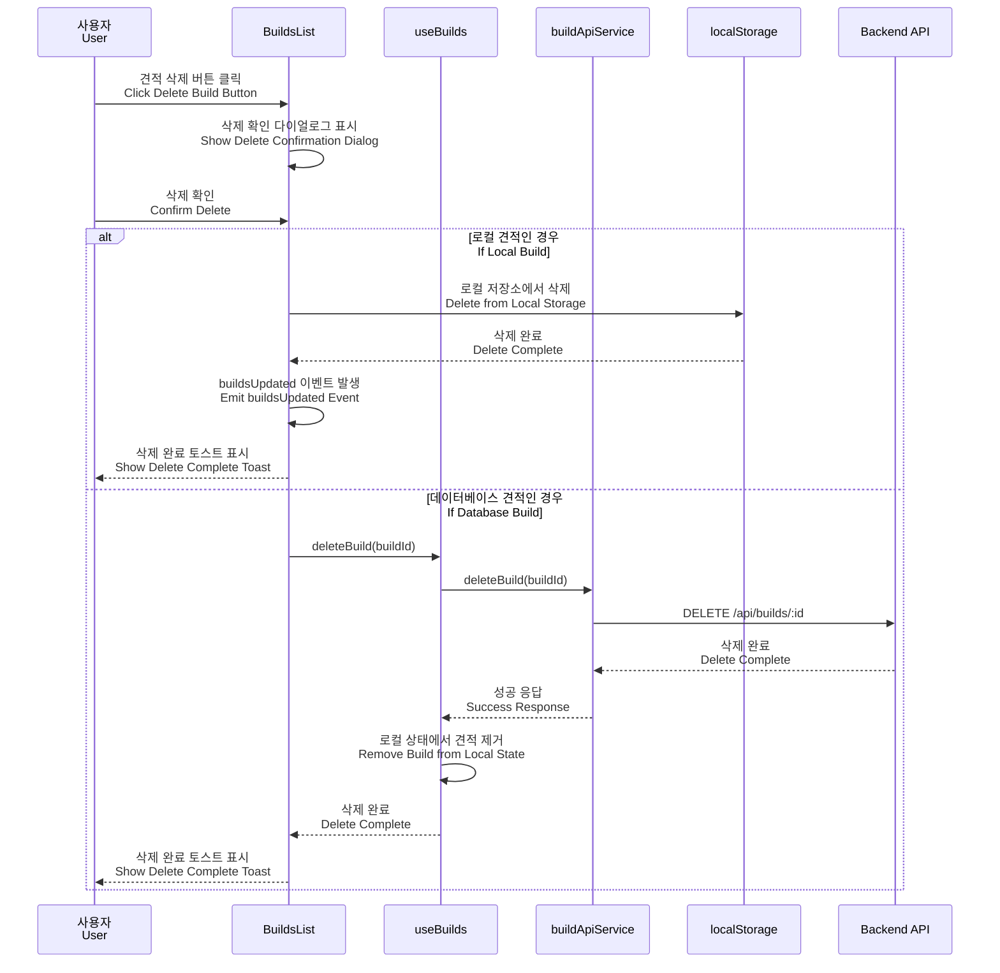
```mermaid
sequenceDiagram
    participant User as 사용자<br/>User
    participant BuildsList as BuildsList
    participant BuildHook as useBuilds
    participant BuildAPI as buildApiService
    participant LocalStorage as localStorage
    participant Backend as Backend API

    User->>BuildsList: 견적 삭제 버튼 클릭<br/>Click Delete Build Button
    BuildsList->>BuildsList: 삭제 확인 다이얼로그 표시<br/>Show Delete Confirmation Dialog
    User->>BuildsList: 삭제 확인<br/>Confirm Delete
    
    alt 로컬 견적인 경우<br/>If Local Build
        BuildsList->>LocalStorage: 로컬 저장소에서 삭제<br/>Delete from Local Storage
        LocalStorage-->>BuildsList: 삭제 완료<br/>Delete Complete
        BuildsList->>BuildsList: buildsUpdated 이벤트 발생<br/>Emit buildsUpdated Event
        BuildsList-->>User: 삭제 완료 토스트 표시<br/>Show Delete Complete Toast
    else 데이터베이스 견적인 경우<br/>If Database Build
        BuildsList->>BuildHook: deleteBuild(buildId)
        BuildHook->>BuildAPI: deleteBuild(buildId)
        BuildAPI->>Backend: DELETE /api/builds/:id
        Backend-->>BuildAPI: 삭제 완료<br/>Delete Complete
        BuildAPI-->>BuildHook: 성공 응답<br/>Success Response
        BuildHook->>BuildHook: 로컬 상태에서 견적 제거<br/>Remove Build from Local State
        BuildHook-->>BuildsList: 삭제 완료<br/>Delete Complete
        BuildsList-->>User: 삭제 완료 토스트 표시<br/>Show Delete Complete Toast
    end
```

### 4.4 응답 렌더링 및 제목 추출 시퀀스

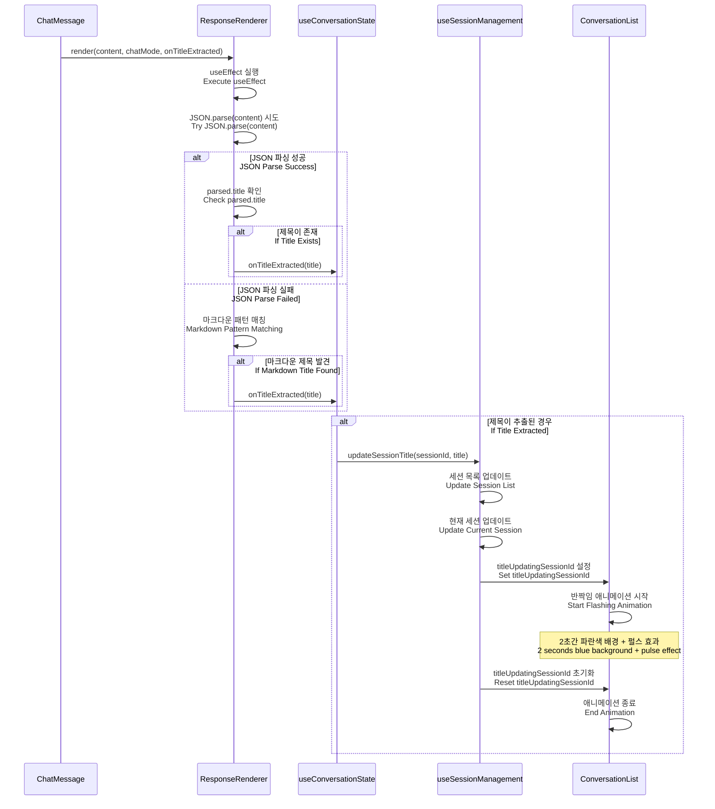
```mermaid
sequenceDiagram
    participant ChatMessage as ChatMessage
    participant Renderer as ResponseRenderer
    participant State as useConversationState
    participant Session as useSessionManagement
    participant UI as ConversationList

    ChatMessage->>Renderer: render(content, chatMode, onTitleExtracted)
    Renderer->>Renderer: useEffect 실행<br/>Execute useEffect
    Renderer->>Renderer: JSON.parse(content) 시도<br/>Try JSON.parse(content)
    
    alt JSON 파싱 성공<br/>JSON Parse Success
        Renderer->>Renderer: parsed.title 확인<br/>Check parsed.title
        alt 제목이 존재<br/>If Title Exists
            Renderer->>State: onTitleExtracted(title)
        end
    else JSON 파싱 실패<br/>JSON Parse Failed
        Renderer->>Renderer: 마크다운 패턴 매칭<br/>Markdown Pattern Matching
        alt 마크다운 제목 발견<br/>If Markdown Title Found
            Renderer->>State: onTitleExtracted(title)
        end
    end
    
    alt 제목이 추출된 경우<br/>If Title Extracted
        State->>Session: updateSessionTitle(sessionId, title)
        Session->>Session: 세션 목록 업데이트<br/>Update Session List
        Session->>Session: 현재 세션 업데이트<br/>Update Current Session
        Session->>UI: titleUpdatingSessionId 설정<br/>Set titleUpdatingSessionId
        UI->>UI: 반짝임 애니메이션 시작<br/>Start Flashing Animation
        
        Note over UI: 2초간 파란색 배경 + 펄스 효과<br/>2 seconds blue background + pulse effect
        
        Session->>UI: titleUpdatingSessionId 초기화<br/>Reset titleUpdatingSessionId
        UI->>UI: 애니메이션 종료<br/>End Animation
    end
```

## 5. 데이터 타입 정의 (Data Type Definitions)

### 5.1 Core Data Types

```typescript
// 세션 관련 타입 Session Related Types
interface Session {
  id: number;
  session_name: string;
  last_modified: string;
  messages: any[];
}

// API 메시지 타입 (백엔드 응답) API Message Type (Backend Response)
interface ApiMessage {
  content: string;
  role: 'user' | 'assistant';
  mode: string;
  id: number;
  session_id: number;
  created_at: string;
}

// UI 메시지 타입 (프론트엔드 사용) UI Message Type (Frontend Use)
interface UIMessage {
  text: string;
  isUser: boolean;
  chatMode?: string;
  expertiseLevel?: 'beginner' | 'intermediate' | 'expert';
}

// 메시지 요청 타입 Message Request Type
interface MessageRequest {
  role: string;
  content: string;
}
```

### 5.2 Build and Component Types

```typescript
// 컴포넌트 타입 Component Type
interface Component {
  name: string;
  type: string;
  image: string;
  specs: string;
  reason: string;
  purchase_link: string;
  price?: number;
  alternatives: {
    name: string;
    specs: string;
    purchase_link: string;
  }[];
}

// 견적 타입 Build Type
interface Build {
  id: number;
  name: string;
  session_id: number;
  components: Component[];
  total_price: number;
  recommendation: string;
  created_at: string;
  rating: {
    performance?: number;
    price_performance?: number;
    expandability?: number;
    noise?: number;
    [key: string]: number | undefined;
  };
  type?: 'estimate_recommendation' | 'spec_upgrade';
}

// 로컬 견적 타입 (localStorage용) Local Build Type (for localStorage)
interface LocalBuild {
  id: number;
  name: string;
  session_id: number;
  parts: {
    name: string;
    type: string;
    specs: string;
    reason: string;
    link: string;
    price: string;
    image?: string;
  }[];
  total_price: number;
  total_reason: string;
  created_at: string;
  rating?: any;
}

// 견적 생성 요청 타입 Create Build Request Type
interface CreateBuildRequest {
  name: string;
  session_id: number;
  components: Component[];
  total_price: number;
  recommendation: string;
  rating?: Build['rating'];
}

// 견적 업데이트 요청 타입 Update Build Request Type
interface UpdateBuildRequest {
  name?: string;
  components?: Component[];
  total_price?: number;
  recommendation?: string;
  rating?: Build['rating'];
}
```

### 5.3 Response Types

```typescript
// 범용 검색 응답 General Search Response
interface GeneralSearchResponse {
  content: string;
  expertiseLevel: 'beginner' | 'intermediate' | 'expert';
  title?: string;
}

// 부품 추천 응답 Part Recommendation Response
interface PartRecommendationResponse {
  parts: {
    [key: string]: {
      name: string;
      reason: string;
      price: string;
      specs: string;
      link: string;
      image_url: string;
    };
  };
  suggestion: string;
  title?: string;
}

// 호환성 검사 응답 Compatibility Check Response
interface CompatibilityCheckResponse {
  components: string[];
  [key: string]: boolean | string | string[] | null;
  edge_case?: boolean;
  edge_reason?: string;
  suggestion?: string;
  title?: string;
}

// 견적 추천 응답 Build Recommendation Response
interface BuildRecommendationResponse {
  title: string;
  parts: {
    [key: string]: {
      name: string;
      price: string;
      specs: string;
      reason: string;
      link: string;
      image_url: string;
    };
  };
  total_price: string;
  total_reason: string;
  suggestion: string;
}

// 스펙 업그레이드 응답 Spec Upgrade Response
interface SpecUpgradeResponse {
  title: string;
  upgrade_parts: {
    [key: string]: {
      current: {
        name: string;
        specs: string;
        price: string;
      };
      recommended: {
        name: string;
        specs: string;
        price: string;
        reason: string;
        link: string;
        image_url: string;
      };
    };
  };
  total_upgrade_cost: string;
  performance_improvement: string;
  suggestion: string;
}

// 견적 평가 응답 Build Evaluation Response
interface BuildEvaluationResponse {
  performance: {
    score: number;
    comment: string;
  };
  price_performance: {
    score: number;
    comment: string;
  };
  expandability: {
    score: number;
    comment: string;
  };
  noise: {
    score: number;
    comment: string;
  };
  average_score: number;
  suggestion?: string;
  title?: string;
}
```

### 5.4 API Service Types

```typescript
// API 응답 기본 타입 Basic API Response Type
interface ApiResponse<T> {
  data: T;
  message: string;
  success: boolean;
}

// 페이지네이션 응답 타입 Pagination Response Type
interface PaginatedResponse<T> {
  data: T[];
  total: number;
  page: number;
  limit: number;
  total_pages: number;
}

// 견적 목록 API 응답 Build List API Response
interface BuildsListResponse extends PaginatedResponse<Build> {}

// 견적 상세 API 응답 Build Detail API Response
interface BuildDetailResponse extends ApiResponse<Build> {}

// 견적 생성 API 응답 Create Build API Response
interface CreateBuildResponse extends ApiResponse<Build> {}

// 견적 삭제 API 응답 Delete Build API Response
interface DeleteBuildResponse extends ApiResponse<null> {}

// 오류 응답 타입 Error Response Type
interface ErrorResponse {
  error: string;
  message: string;
  code: number;
}
```

### 5.5 Hook State Types

```typescript
// 대화 상태 타입 Conversation State Type
interface ConversationState {
  // 세션 관리 Session Management
  currentConversation: Session | null;
  conversations: Session[];
  convoLoading: boolean;
  titleUpdatingSessionId: number | null;

  // 메시지 관리 Message Management
  messages: UIMessage[];
  dbMessages: ApiMessage[];
  isLoading: boolean;
  msgLoading: boolean;

  // 견적 관리 Build Management
  builds: Build[];
  buildsLoading: boolean;
  isGeneratingBuilds: boolean;

  // UI 상태 UI State
  showExample: boolean;
  chatMode: string;
  autoSwitchDisabled: boolean;
  sessionId?: string;
}

// 견적 훅 상태 타입 Build Hook State Type
interface BuildsState {
  builds: Build[];
  loading: boolean;
  error: string | null;
  selectedBuild: Build | null;
  retryCount: number;
  lastBuildId: number | null;
  lastCheckTime: number;
  consecutiveErrors: number;
}

// 컴포넌트 Props 타입 Component Props Types
interface SidebarProps {
  isOpen: boolean;
  onToggle: () => void;
  title: string;
  position: 'left' | 'right';
  children: React.ReactNode;
}

interface ChatMainProps {
  messages: UIMessage[];
  isLoading: boolean;
  showExample: boolean;
  chatMode: string;
  setChatMode: (mode: string) => void;
  sendMessage: (text: string) => Promise<void>;
  getExamplePrompt: () => string;
  sessionId?: string;
  onTitleExtracted?: (title: string) => void;
}

interface BuildsListProps {
  builds: Build[];
  loading: boolean;
  error: string | null;
  onViewBuild: (buildId: string) => void;
  onDelete: (buildId: string) => void;
  onRefresh?: () => void;
}
```

## 6. 상태 관리 아키텍처 (State Management Architecture)

### 6.1 상태 흐름 다이어그램

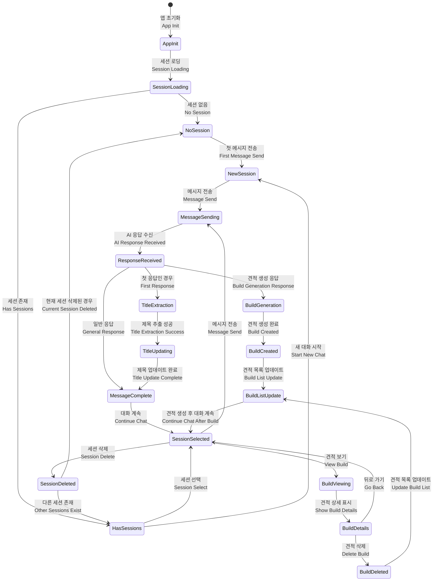
```mermaid
stateDiagram-v2
    [*] --> AppInit: 앱 초기화<br/>App Init
    AppInit --> SessionLoading: 세션 로딩<br/>Session Loading
    SessionLoading --> NoSession: 세션 없음<br/>No Session
    SessionLoading --> HasSessions: 세션 존재<br/>Has Sessions
    
    NoSession --> NewSession : 첫 메시지 전송<br/>First Message Send
    HasSessions --> SessionSelected : 세션 선택<br/>Session Select
    HasSessions --> NewSession : 새 대화 시작<br/>Start New Chat
    
    NewSession --> MessageSending : 메시지 전송<br/>Message Send
    SessionSelected --> MessageSending : 메시지 전송<br/>Message Send
    
    MessageSending --> ResponseReceived : AI 응답 수신<br/>AI Response Received
    ResponseReceived --> BuildGeneration : 견적 생성 응답<br/>Build Generation Response
    ResponseReceived --> TitleExtraction : 첫 응답인 경우<br/>First Response
    ResponseReceived --> MessageComplete : 일반 응답<br/>General Response
    
    BuildGeneration --> BuildCreated : 견적 생성 완료<br/>Build Created
    BuildCreated --> BuildListUpdate : 견적 목록 업데이트<br/>Build List Update
    
    TitleExtraction --> TitleUpdating : 제목 추출 성공<br/>Title Extraction Success
    TitleUpdating --> MessageComplete : 제목 업데이트 완료<br/>Title Update Complete
    
    MessageComplete --> SessionSelected : 대화 계속<br/>Continue Chat
    BuildListUpdate --> SessionSelected : 견적 생성 후 대화 계속<br/>Continue Chat After Build
    
    SessionSelected --> SessionDeleted : 세션 삭제<br/>Session Delete
    SessionSelected --> BuildViewing : 견적 보기<br/>View Build
    
    BuildViewing --> BuildDetails : 견적 상세 표시<br/>Show Build Details
    BuildDetails --> BuildDeleted : 견적 삭제<br/>Delete Build
    BuildDetails --> SessionSelected : 뒤로 가기<br/>Go Back
    
    BuildDeleted --> BuildListUpdate : 견적 목록 업데이트<br/>Update Build List
    SessionDeleted --> NoSession : 현재 세션 삭제된 경우<br/>Current Session Deleted
    SessionDeleted --> HasSessions : 다른 세션 존재<br/>Other Sessions Exist
```

### 6.2 Hook 의존성 그래프

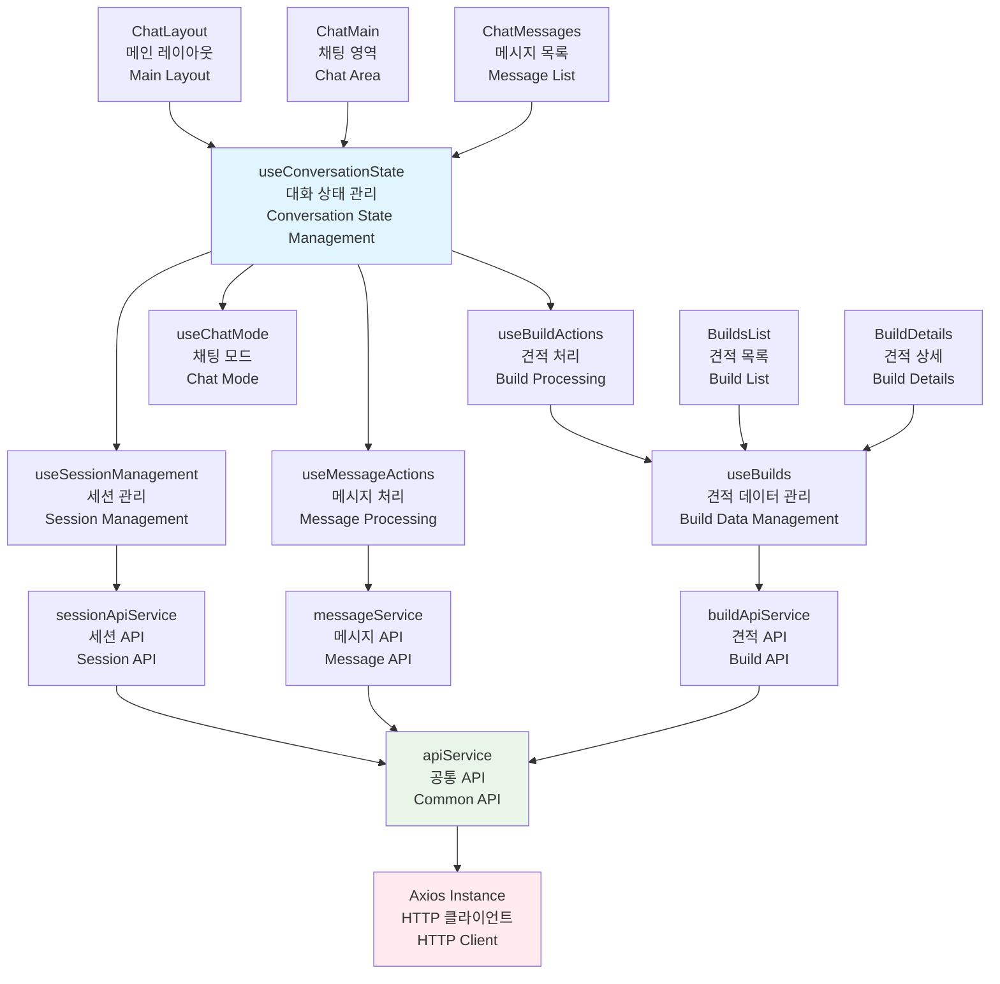
```mermaid
graph TD
    useConversationState["useConversationState<br/>대화 상태 관리<br/>Conversation State Management"] --> useSessionManagement["useSessionManagement<br/>세션 관리<br/>Session Management"]
    useConversationState --> useMessageActions["useMessageActions<br/>메시지 처리<br/>Message Processing"]
    useConversationState --> useBuildActions["useBuildActions<br/>견적 처리<br/>Build Processing"]
    useConversationState --> useChatMode["useChatMode<br/>채팅 모드<br/>Chat Mode"]
    
    useBuildActions --> useBuilds["useBuilds<br/>견적 데이터 관리<br/>Build Data Management"]
    
    useSessionManagement --> sessionApiService["sessionApiService<br/>세션 API<br/>Session API"]
    useMessageActions --> messageService["messageService<br/>메시지 API<br/>Message API"]
    useBuilds --> buildApiService["buildApiService<br/>견적 API<br/>Build API"]
    
    sessionApiService --> apiService["apiService<br/>공통 API<br/>Common API"]
    messageService --> apiService
    buildApiService --> apiService
    
    apiService --> AxiosInstance["Axios Instance<br/>HTTP 클라이언트<br/>HTTP Client"]
    
    ChatLayout["ChatLayout<br/>메인 레이아웃<br/>Main Layout"] --> useConversationState
    ChatMain["ChatMain<br/>채팅 영역<br/>Chat Area"] --> useConversationState
    ChatMessages["ChatMessages<br/>메시지 목록<br/>Message List"] --> useConversationState
    BuildsList["BuildsList<br/>견적 목록<br/>Build List"] --> useBuilds
    BuildDetails["BuildDetails<br/>견적 상세<br/>Build Details"] --> useBuilds
    
    style useConversationState fill:#e1f5fe
    style apiService fill:#e8f5e8
    style AxiosInstance fill:#ffebee
```

## 7. API 통신 아키텍처 (API Communication Architecture)

### 7.1 API 엔드포인트 매핑

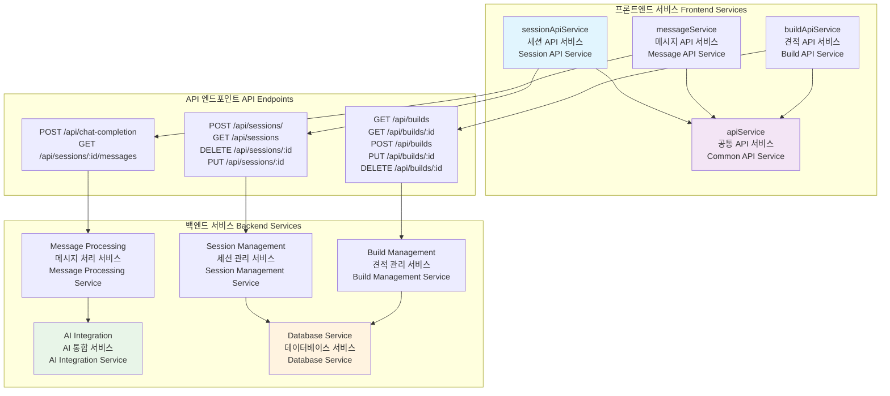
```mermaid
graph TB
    subgraph "프론트엔드 서비스 Frontend Services"
        SessionAPI["sessionApiService<br/>세션 API 서비스<br/>Session API Service"]
        MessageAPI["messageService<br/>메시지 API 서비스<br/>Message API Service"]
        BuildAPI["buildApiService<br/>견적 API 서비스<br/>Build API Service"]
        CommonAPI["apiService<br/>공통 API 서비스<br/>Common API Service"]
    end
    
    subgraph "API 엔드포인트 API Endpoints"
        SessionEndpoints["POST /api/sessions/<br/>GET /api/sessions<br/>DELETE /api/sessions/:id<br/>PUT /api/sessions/:id"]
        MessageEndpoints["POST /api/chat-completion<br/>GET /api/sessions/:id/messages"]
        BuildEndpoints["GET /api/builds<br/>GET /api/builds/:id<br/>POST /api/builds<br/>PUT /api/builds/:id<br/>DELETE /api/builds/:id"]
    end
    
    subgraph "백엔드 서비스 Backend Services"
        SessionService["Session Management<br/>세션 관리 서비스<br/>Session Management Service"]
        MessageService["Message Processing<br/>메시지 처리 서비스<br/>Message Processing Service"]
        BuildService["Build Management<br/>견적 관리 서비스<br/>Build Management Service"]
        AIService["AI Integration<br/>AI 통합 서비스<br/>AI Integration Service"]
        DatabaseService["Database Service<br/>데이터베이스 서비스<br/>Database Service"]
    end
    
    SessionAPI --> SessionEndpoints
    MessageAPI --> MessageEndpoints
    BuildAPI --> BuildEndpoints
    
    SessionAPI --> CommonAPI
    MessageAPI --> CommonAPI
    BuildAPI --> CommonAPI
    
    SessionEndpoints --> SessionService
    MessageEndpoints --> MessageService
    BuildEndpoints --> BuildService
    
    MessageService --> AIService
    SessionService --> DatabaseService
    BuildService --> DatabaseService
    
    style SessionAPI fill:#e1f5fe
    style CommonAPI fill:#f3e5f5
    style AIService fill:#e8f5e8
    style DatabaseService fill:#fff3e0
```

### 7.2 견적 API 엔드포인트 상세

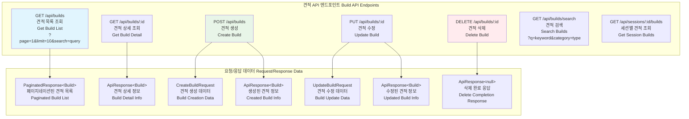
```mermaid
graph TB
    subgraph "견적 API 엔드포인트 Build API Endpoints"
        GetBuilds["GET /api/builds<br/>견적 목록 조회<br/>Get Build List<br/>?page=1&limit=10&search=query"]
        GetBuild["GET /api/builds/:id<br/>견적 상세 조회<br/>Get Build Detail"]
        CreateBuild["POST /api/builds<br/>견적 생성<br/>Create Build"]
        UpdateBuild["PUT /api/builds/:id<br/>견적 수정<br/>Update Build"]
        DeleteBuild["DELETE /api/builds/:id<br/>견적 삭제<br/>Delete Build"]
        SearchBuilds["GET /api/builds/search<br/>견적 검색<br/>Search Builds<br/>?q=keyword&category=type"]
        GetSessionBuilds["GET /api/sessions/:id/builds<br/>세션별 견적 조회<br/>Get Session Builds"]
    end
    
    subgraph "요청/응답 데이터 Request/Response Data"
        GetBuildsRes["PaginatedResponse&lt;Build&gt;<br/>페이지네이션된 견적 목록<br/>Paginated Build List"]
        GetBuildRes["ApiResponse&lt;Build&gt;<br/>견적 상세 정보<br/>Build Detail Info"]
        CreateBuildReq["CreateBuildRequest<br/>견적 생성 데이터<br/>Build Creation Data"]
        CreateBuildRes["ApiResponse&lt;Build&gt;<br/>생성된 견적 정보<br/>Created Build Info"]
        UpdateBuildReq["UpdateBuildRequest<br/>견적 수정 데이터<br/>Build Update Data"]
        UpdateBuildRes["ApiResponse&lt;Build&gt;<br/>수정된 견적 정보<br/>Updated Build Info"]
        DeleteBuildRes["ApiResponse&lt;null&gt;<br/>삭제 완료 응답<br/>Delete Completion Response"]
    end
    
    GetBuilds --> GetBuildsRes
    GetBuild --> GetBuildRes
    CreateBuild --> CreateBuildReq
    CreateBuild --> CreateBuildRes
    UpdateBuild --> UpdateBuildReq
    UpdateBuild --> UpdateBuildRes
    DeleteBuild --> DeleteBuildRes
    
    style GetBuilds fill:#e1f5fe
    style CreateBuild fill:#e8f5e8
    style DeleteBuild fill:#ffebee
```

### 7.3 에러 처리 플로우

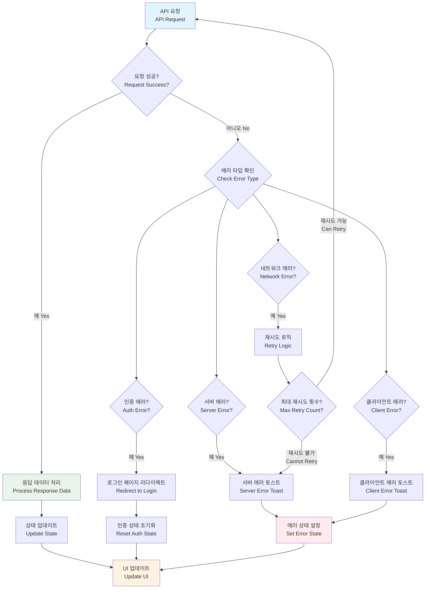
```mermaid
flowchart TD
    APIRequest["API 요청<br/>API Request"] --> RequestSuccess{"요청 성공?<br/>Request Success?"}
    
    RequestSuccess -->|예 Yes| ResponseData["응답 데이터 처리<br/>Process Response Data"]
    RequestSuccess -->|아니오 No| ErrorType{"에러 타입 확인<br/>Check Error Type"}
    
    ErrorType --> NetworkError{"네트워크 에러?<br/>Network Error?"}
    ErrorType --> AuthError{"인증 에러?<br/>Auth Error?"}
    ErrorType --> ServerError{"서버 에러?<br/>Server Error?"}
    ErrorType --> ClientError{"클라이언트 에러?<br/>Client Error?"}
    
    NetworkError -->|예 Yes| RetryLogic["재시도 로직<br/>Retry Logic"]
    AuthError -->|예 Yes| AuthRedirect["로그인 페이지 리다이렉트<br/>Redirect to Login"]
    ServerError -->|예 Yes| ServerErrorToast["서버 에러 토스트<br/>Server Error Toast"]
    ClientError -->|예 Yes| ClientErrorToast["클라이언트 에러 토스트<br/>Client Error Toast"]
    
    RetryLogic --> RetryCheck{"최대 재시도 횟수?<br/>Max Retry Count?"}
    RetryCheck -->|재시도 가능<br/>Can Retry| APIRequest
    RetryCheck -->|재시도 불가<br/>Cannot Retry| ServerErrorToast
    
    ResponseData --> StateUpdate["상태 업데이트<br/>Update State"]
    AuthRedirect --> AuthReset["인증 상태 초기화<br/>Reset Auth State"]
    ServerErrorToast --> ErrorState["에러 상태 설정<br/>Set Error State"]
    ClientErrorToast --> ErrorState
    
    StateUpdate --> UIUpdate["UI 업데이트<br/>Update UI"]
    AuthReset --> UIUpdate
    ErrorState --> UIUpdate
    
    style APIRequest fill:#e1f5fe
    style ResponseData fill:#e8f5e8
    style ErrorState fill:#ffebee
    style UIUpdate fill:#fff3e0
```

## 8. 컴포넌트 라이프사이클 (Component Lifecycle)

### 8.1 ChatLayout 라이프사이클

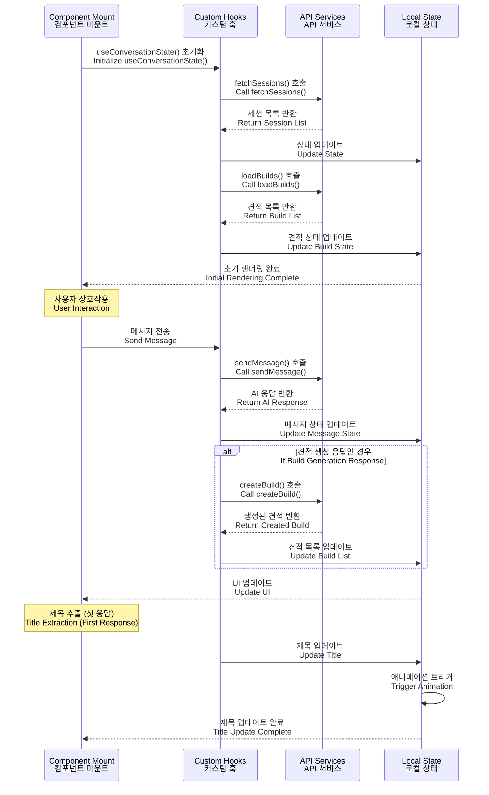
```mermaid
sequenceDiagram
    participant Mount as Component Mount<br/>컴포넌트 마운트
    participant Hooks as Custom Hooks<br/>커스텀 훅
    participant API as API Services<br/>API 서비스
    participant State as Local State<br/>로컬 상태

    Mount->>Hooks: useConversationState() 초기화<br/>Initialize useConversationState()
    Hooks->>API: fetchSessions() 호출<br/>Call fetchSessions()
    API-->>Hooks: 세션 목록 반환<br/>Return Session List
    Hooks->>State: 상태 업데이트<br/>Update State
    
    Hooks->>API: loadBuilds() 호출<br/>Call loadBuilds()
    API-->>Hooks: 견적 목록 반환<br/>Return Build List
    Hooks->>State: 견적 상태 업데이트<br/>Update Build State
    
    State-->>Mount: 초기 렌더링 완료<br/>Initial Rendering Complete
    
    Note over Mount: 사용자 상호작용<br/>User Interaction
    
    Mount->>Hooks: 메시지 전송<br/>Send Message
    Hooks->>API: sendMessage() 호출<br/>Call sendMessage()
    API-->>Hooks: AI 응답 반환<br/>Return AI Response
    Hooks->>State: 메시지 상태 업데이트<br/>Update Message State
    
    alt 견적 생성 응답인 경우<br/>If Build Generation Response
        Hooks->>API: createBuild() 호출<br/>Call createBuild()
        API-->>Hooks: 생성된 견적 반환<br/>Return Created Build
        Hooks->>State: 견적 목록 업데이트<br/>Update Build List
    end
    
    State-->>Mount: UI 업데이트<br/>Update UI
    
    Note over Mount: 제목 추출 (첫 응답)<br/>Title Extraction (First Response)
    
    Hooks->>State: 제목 업데이트<br/>Update Title
    State->>State: 애니메이션 트리거<br/>Trigger Animation
    State-->>Mount: 제목 업데이트 완료<br/>Title Update Complete
```

### 8.2 BuildsList 라이프사이클

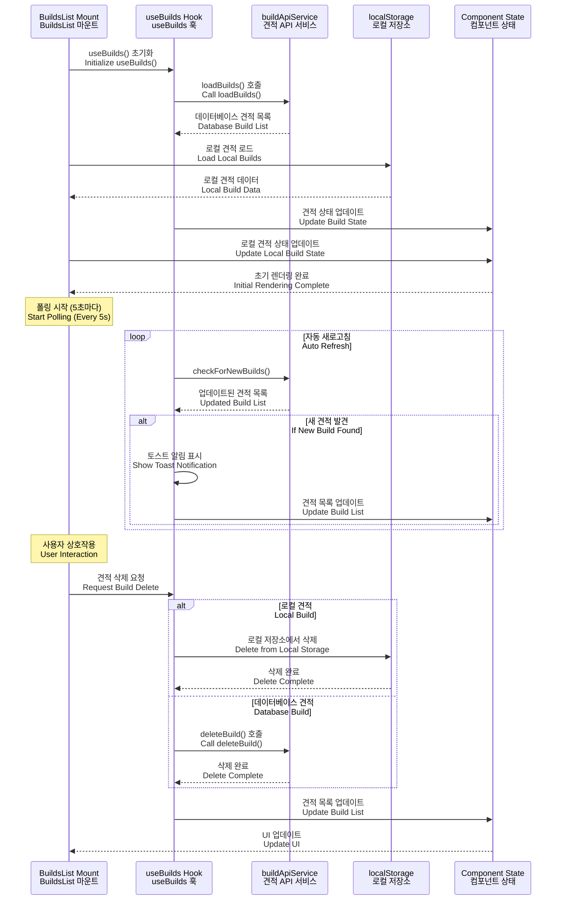
```mermaid
sequenceDiagram
    participant Mount as BuildsList Mount<br/>BuildsList 마운트
    participant Hook as useBuilds Hook<br/>useBuilds 훅
    participant API as buildApiService<br/>견적 API 서비스
    participant LocalStorage as localStorage<br/>로컬 저장소
    participant State as Component State<br/>컴포넌트 상태

    Mount->>Hook: useBuilds() 초기화<br/>Initialize useBuilds()
    Hook->>API: loadBuilds() 호출<br/>Call loadBuilds()
    API-->>Hook: 데이터베이스 견적 목록<br/>Database Build List
    
    Mount->>LocalStorage: 로컬 견적 로드<br/>Load Local Builds
    LocalStorage-->>Mount: 로컬 견적 데이터<br/>Local Build Data
    
    Hook->>State: 견적 상태 업데이트<br/>Update Build State
    Mount->>State: 로컬 견적 상태 업데이트<br/>Update Local Build State
    State-->>Mount: 초기 렌더링 완료<br/>Initial Rendering Complete
    
    Note over Mount: 폴링 시작 (5초마다)<br/>Start Polling (Every 5s)
    
    loop 자동 새로고침<br/>Auto Refresh
        Hook->>API: checkForNewBuilds()
        API-->>Hook: 업데이트된 견적 목록<br/>Updated Build List
        alt 새 견적 발견<br/>If New Build Found
            Hook->>Hook: 토스트 알림 표시<br/>Show Toast Notification
            Hook->>State: 견적 목록 업데이트<br/>Update Build List
        end
    end
    
    Note over Mount: 사용자 상호작용<br/>User Interaction
    
    Mount->>Hook: 견적 삭제 요청<br/>Request Build Delete
    alt 로컬 견적<br/>Local Build
        Hook->>LocalStorage: 로컬 저장소에서 삭제<br/>Delete from Local Storage
        LocalStorage-->>Hook: 삭제 완료<br/>Delete Complete
    else 데이터베이스 견적<br/>Database Build
        Hook->>API: deleteBuild() 호출<br/>Call deleteBuild()
        API-->>Hook: 삭제 완료<br/>Delete Complete
    end
    Hook->>State: 견적 목록 업데이트<br/>Update Build List
    State-->>Mount: UI 업데이트<br/>Update UI
```

## 9. 성능 최적화 전략 (Performance Optimization)

### 9.1 렌더링 최적화 (Rendering Optimization)

- **React.memo**: 불필요한 리렌더링 방지
  - `ChatMessage`, `BuildCard`, `ResponseRenderer` 등 자주 렌더링되는 컴포넌트
- **useCallback**: 함수 메모이제이션
  - 이벤트 핸들러, API 호출 함수
- **useMemo**: 계산 결과 메모이제이션
  - 견적 가격 계산, 필터링된 목록
- **지연 로딩**: 큰 컴포넌트의 동적 임포트
  - `BuildDetails`, 대용량 응답 렌더러

### 9.2 상태 최적화 (State Optimization)

- **로컬 상태 분리**: 전역 상태와 로컬 상태 적절한 분리
- **낙관적 업데이트**: 사용자 경험 향상을 위한 즉시 UI 업데이트
- **배치 업데이트**: 여러 상태 변경을 하나로 묶어 처리
- **견적 캐싱**: 자주 조회되는 견적 데이터 메모리 캐싱

### 9.3 네트워크 최적화 (Network Optimization)

- **요청 캐싱**: 중복 API 요청 방지
- **요청 병합**: 동시 요청 최적화
- **에러 재시도**: 네트워크 불안정 상황 대응
- **백그라운드 폴링**: 견적 목록 자동 업데이트

### 9.4 데이터 관리 최적화 (Data Management Optimization)

- **페이지네이션**: 대용량 견적 목록 효율적 로딩
- **가상 스크롤**: 긴 목록의 성능 최적화
- **로컬 저장소 활용**: 임시 견적 데이터 관리
- **스마트 새로고침**: 변경된 데이터만 업데이트

## 10. 보안 고려사항 (Security Considerations)

### 10.1 데이터 보호 (Data Protection)
- 사용자 입력 검증 및 새니타이징
- XSS 방지를 위한 안전한 렌더링
- 민감한 데이터 로컬 저장 금지
- 견적 데이터 암호화

### 10.2 API 보안 (API Security)
- HTTPS 통신 강제
- 적절한 에러 메시지 처리
- 세션 관리 보안
- API 요청 제한 (Rate Limiting)

### 10.3 인증 및 권한 (Authentication & Authorization)
- JWT 토큰 기반 인증
- 세션 기반 권한 관리
- API 키 보안 관리
- 견적 접근 권한 제어

## 11. 테스트 전략 (Testing Strategy)

### 11.1 단위 테스트 (Unit Testing)
- 개별 컴포넌트 테스트 (`ChatMessage`, `BuildCard`)
- 커스텀 훅 테스트 (`useBuilds`, `useConversationState`)
- 유틸리티 함수 테스트 (가격 계산, 데이터 변환)
- API 서비스 테스트 (`buildApiService`, `messageService`)

### 11.2 통합 테스트 (Integration Testing)
- 컴포넌트 간 상호작용 테스트
- API 통신 테스트
- 상태 관리 테스트
- 견적 생성 플로우 테스트

### 11.3 E2E 테스트 (End-to-End Testing)
- 사용자 플로우 테스트 (견적 요청 → 생성 → 조회)
- 크로스 브라우저 테스트
- 반응형 디자인 테스트
- 성능 테스트

이 Design Specification은 PC 견적 AI 어시스턴트 Frontend의 전체적인 구조와 설계 원칙을 제시하며, 견적 관리 기능을 포함한 완전한 시스템 아키텍처를 제공합니다. 개발팀이 일관된 방향으로 개발을 진행할 수 있도록 상세한 가이드라인을 제공합니다.
